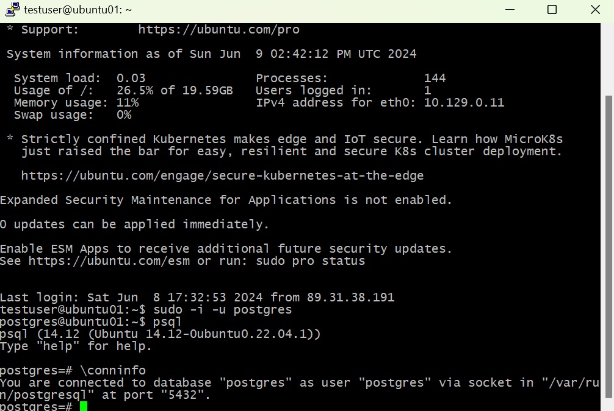
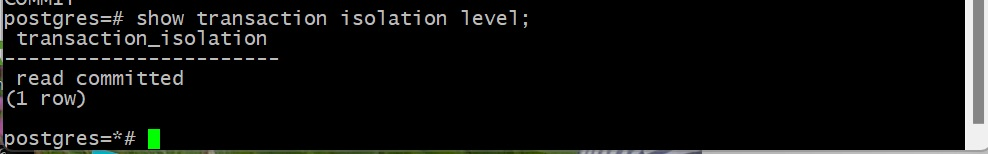
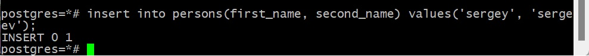
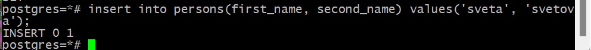
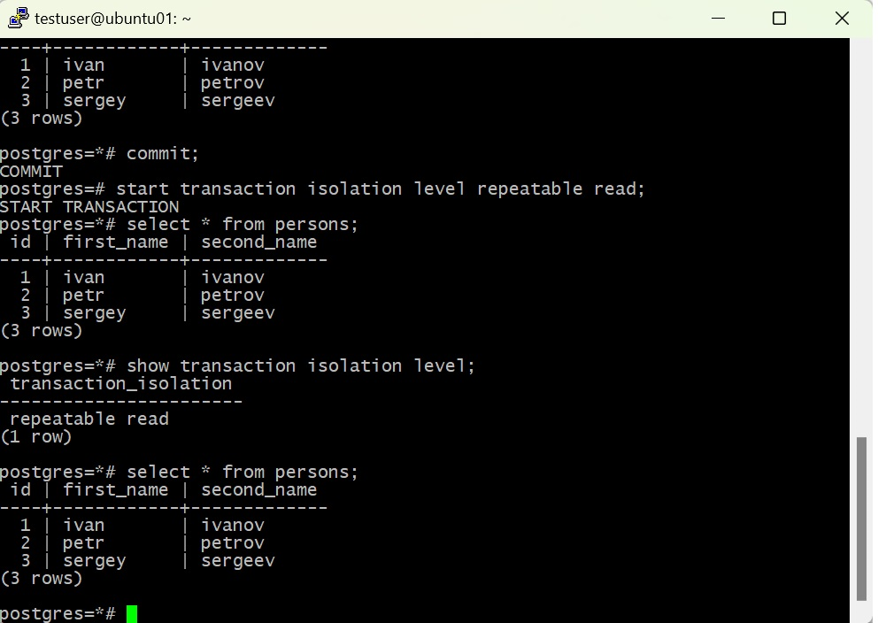

# Домашнее задание №1

*	создать новый проект в Google Cloud Platform, Яндекс облако или на любых ВМ, докере
*	далее создать инстанс виртуальной машины с дефолтными параметрами
*	добавить свой ssh ключ в metadata ВМ
*	зайти удаленным ssh (первая сессия), не забывайте про ssh-add
*	поставить PostgreSQL
*	зайти вторым ssh (вторая сессия)
*	запустить везде psql из под пользователя postgres
*	выключить auto commit

Создана виртуальная машина c Ubuntu 22.04 LTS на Яндекс Облаке.

В Ubuntu cозданы два пользователя: sanni и testuser. Для каждого сгенерированы пары ключей для подключения по ssh.

