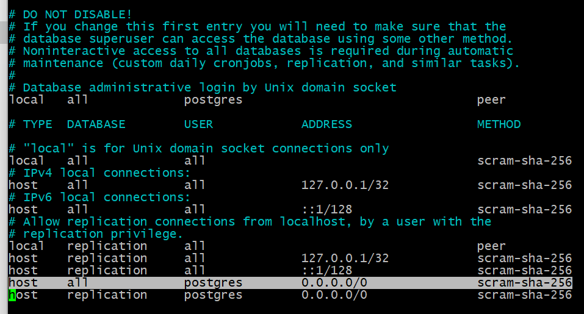
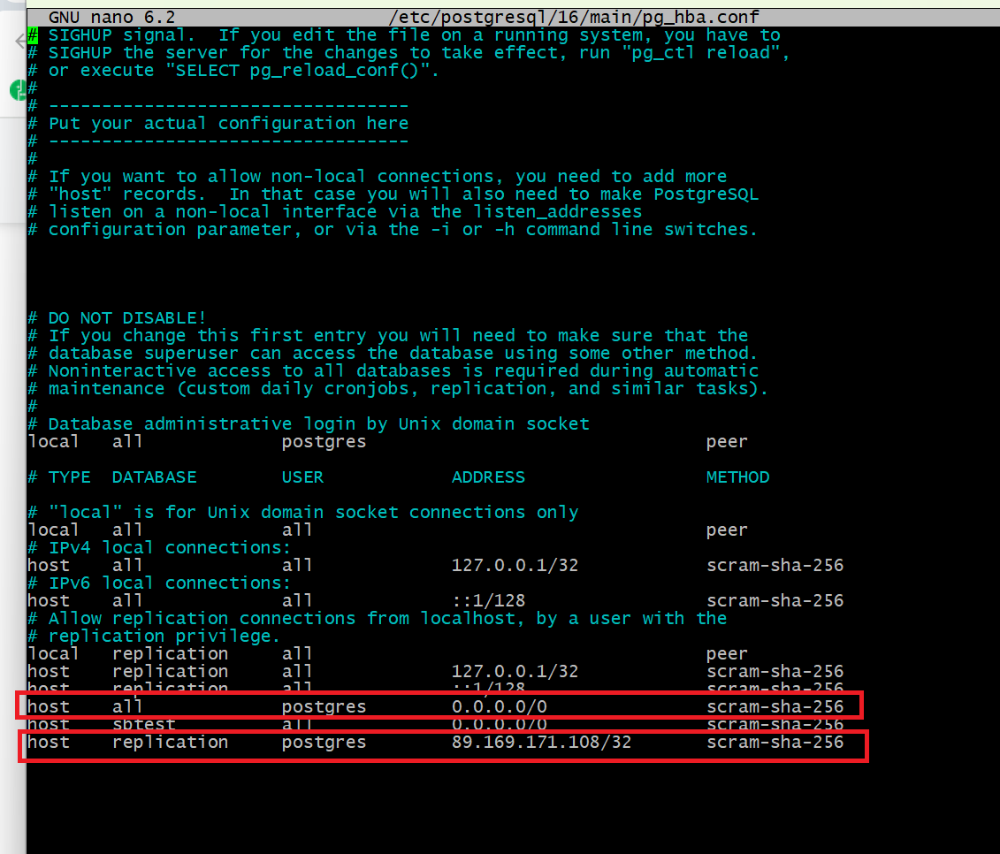

# Домашнее задание №10

* **На 1 ВМ создаем таблицы test для записи, test2 для запросов на чтение.**  
* **Создаем публикацию таблицы test и подписываемся на публикацию таблицы test2 с ВМ №2.**  
* **На 2 ВМ создаем таблицы test2 для записи, test для запросов на чтение.**  
* **Создаем публикацию таблицы test2 и подписываемся на публикацию таблицы test1 с ВМ №1.**  
  
  
  
  
  
_Делаем данные настройки на 1 и 2 ВМ. (IP адреса указываются соответственно принципа на 1 ВМ указывается IP 2 ВМ и наоборот)_  

* **3 ВМ использовать как реплику для чтения и бэкапов (подписаться на таблицы из ВМ №1 и №2 ).**  
  
  
  
  
  
  
  
  
  
  
__  

