# Домашнее задание №10

* **На 1 ВМ создаем таблицы test для записи, test2 для запросов на чтение.**  
* **Создаем публикацию таблицы test и подписываемся на публикацию таблицы test2 с ВМ №2.**  
* **На 2 ВМ создаем таблицы test2 для записи, test для запросов на чтение.**  
* **Создаем публикацию таблицы test2 и подписываемся на публикацию таблицы test1 с ВМ №1.**  
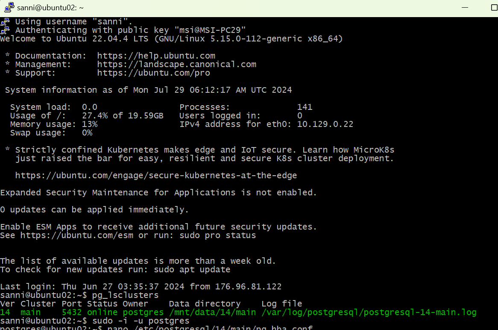  
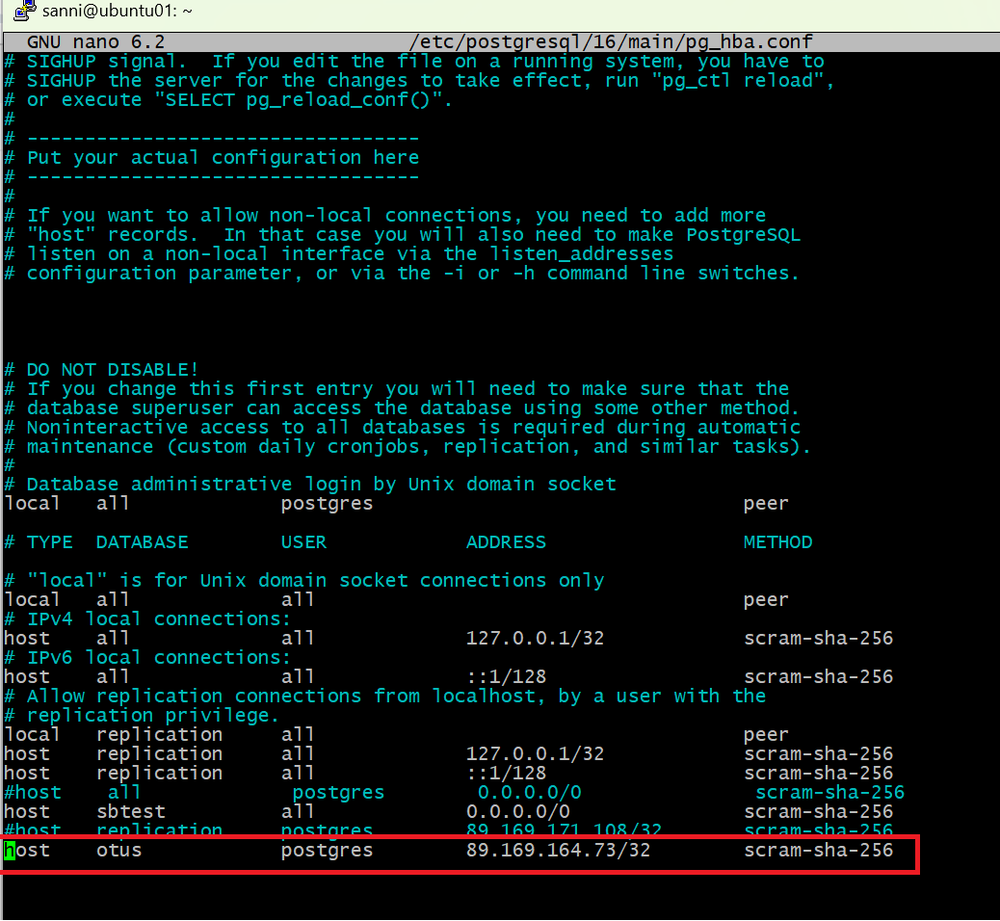  
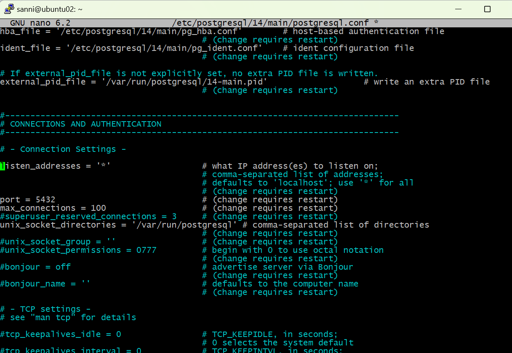  
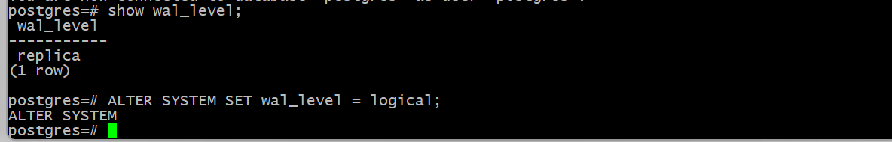  
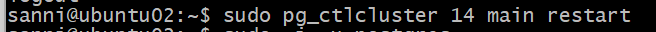  
_Делаем данные настройки на 1 и 2 ВМ. (IP адреса указываются соответственно принципа на 1 ВМ указывается IP 2 ВМ и наоборот)_  
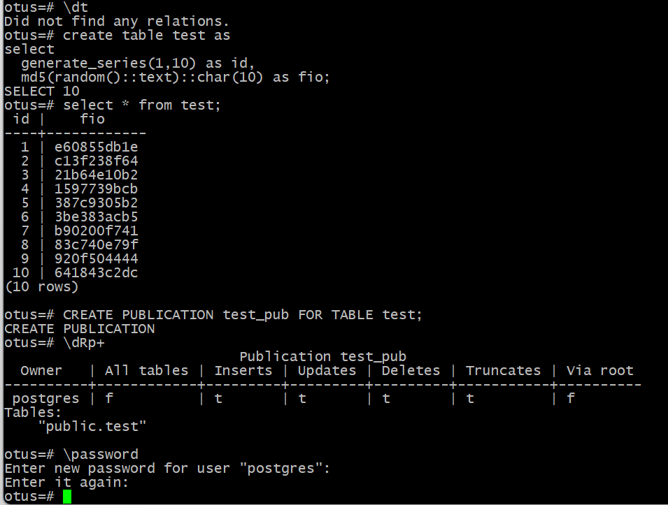  
_Создаём таблицу test и её публикацию на первой машине._  
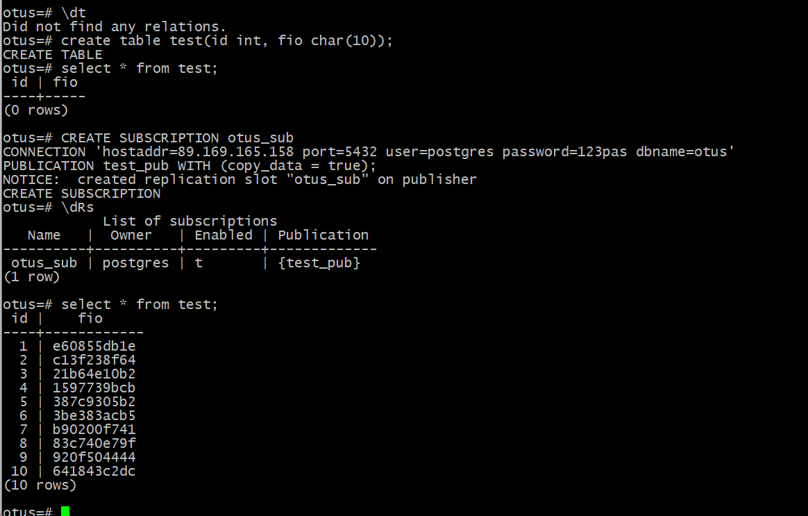  
_Создаём таблицу test на второй машине и подписываемся на публикацию таблицы test на первой машине._  
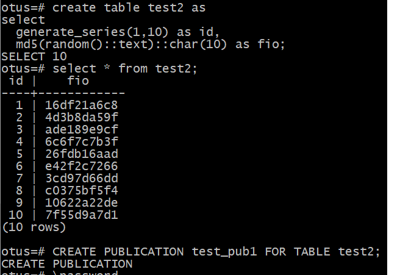  
_Создаём таблицу test2 и её публикацию на второй машине._  
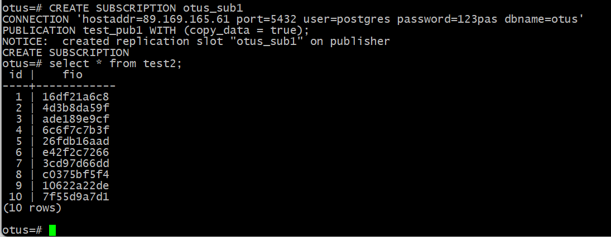  
_Создаём таблицу test2 на первой машине и подписываемся на публикацию таблицы test2 на второй машине._  
* **3 ВМ использовать как реплику для чтения и бэкапов (подписаться на таблицы из ВМ №1 и №2 ).**  
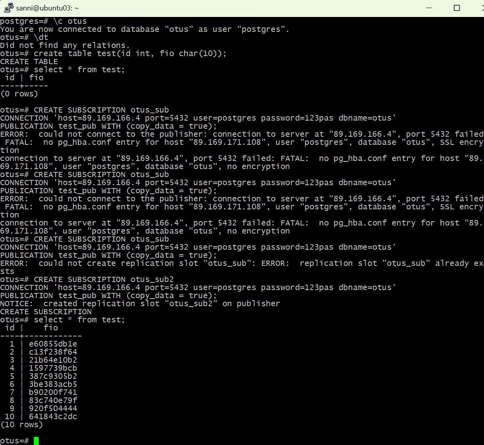  
_Данные ошибки связаны с тем, что я забыл прописать IP 3 ВМ в файле pg_hba.conf на 1 и 2 ВМ._  
_Плюс я пытался создать подписку с именем, которое уже было использовано мною ранее._  
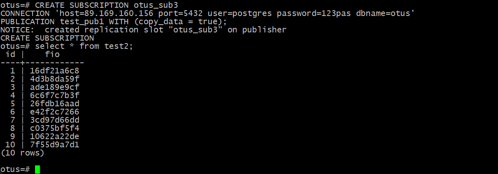  
_После устранения данных ошибок создание подписки отработало нормально._  

***реализовать горячее реплицирование для высокой доступности на 4ВМ. Источником должна выступать ВМ №3. Написать с какими проблемами столкнулись.**  
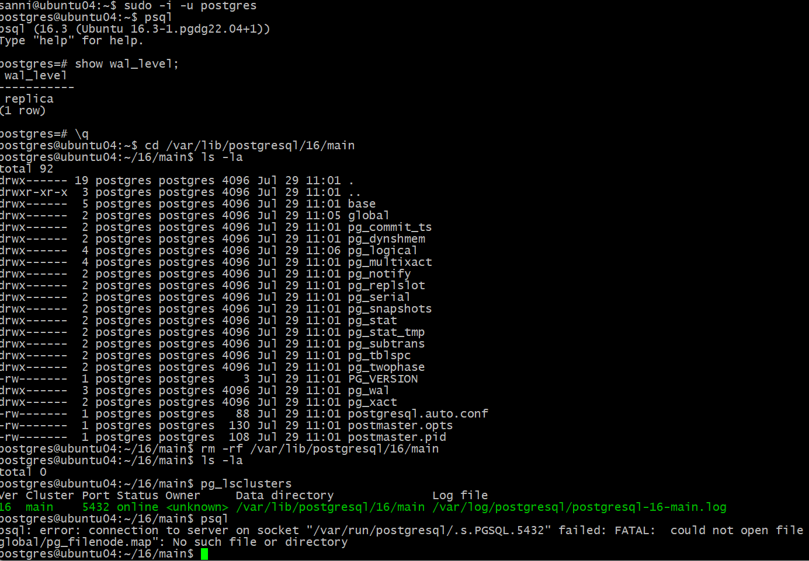  
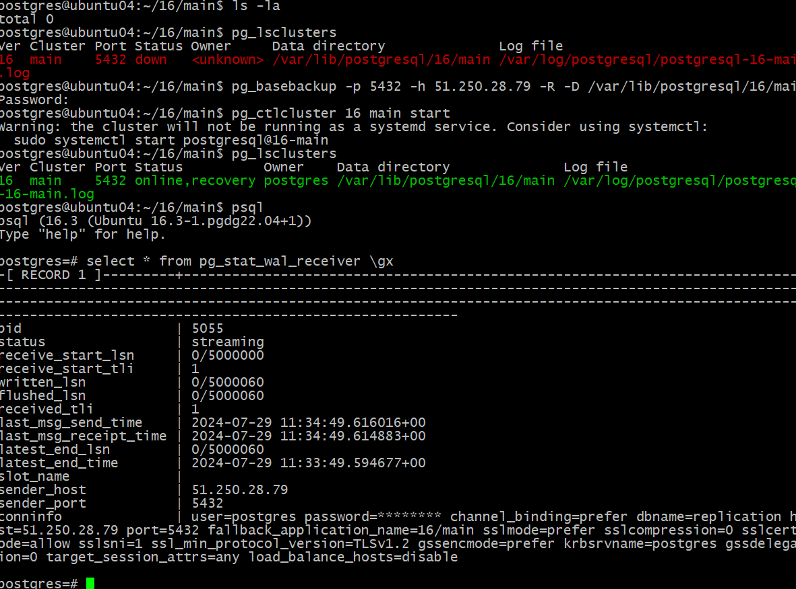  
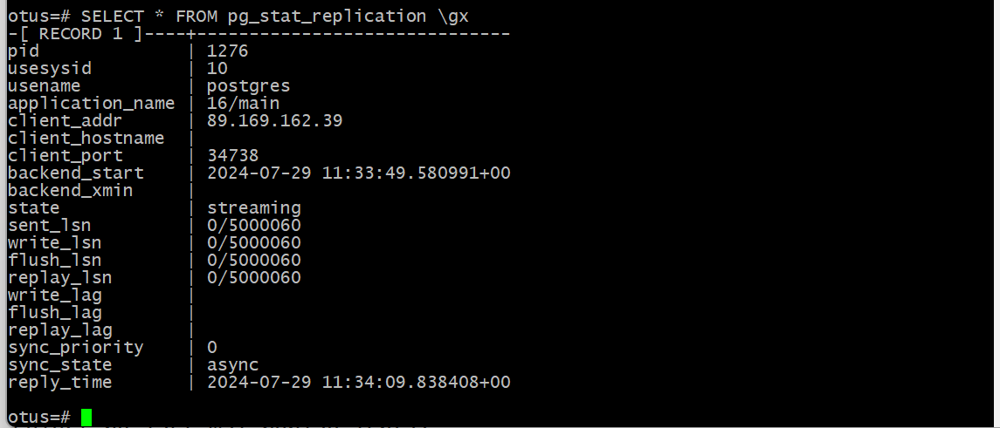  
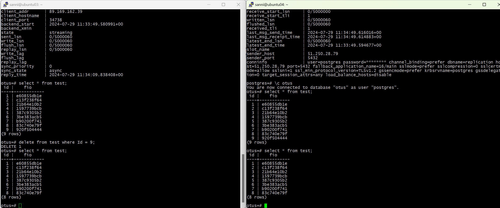  
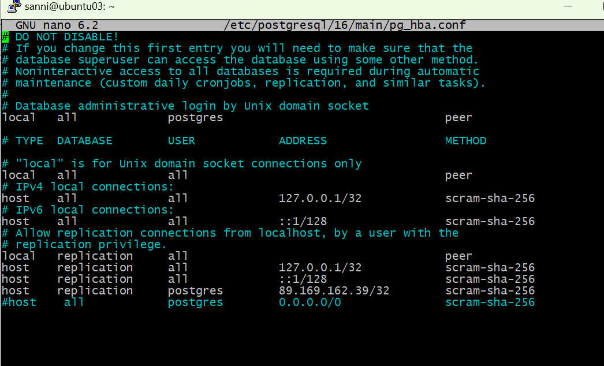  
_На 3 ВМ нужно сделать такие настройки._  
_Проблем с данным заданием не возникло._  

