# Домашнее задание №10

* **На 1 ВМ создаем таблицы test для записи, test2 для запросов на чтение.**  
* **Создаем публикацию таблицы test и подписываемся на публикацию таблицы test2 с ВМ №2.**  
* **На 2 ВМ создаем таблицы test2 для записи, test для запросов на чтение.**  
* **Создаем публикацию таблицы test2 и подписываемся на публикацию таблицы test1 с ВМ №1.**  

* **Создаем БД, схему и в ней таблицу.**  
* **Заполним таблицы автосгенерированными 100 записями.**  
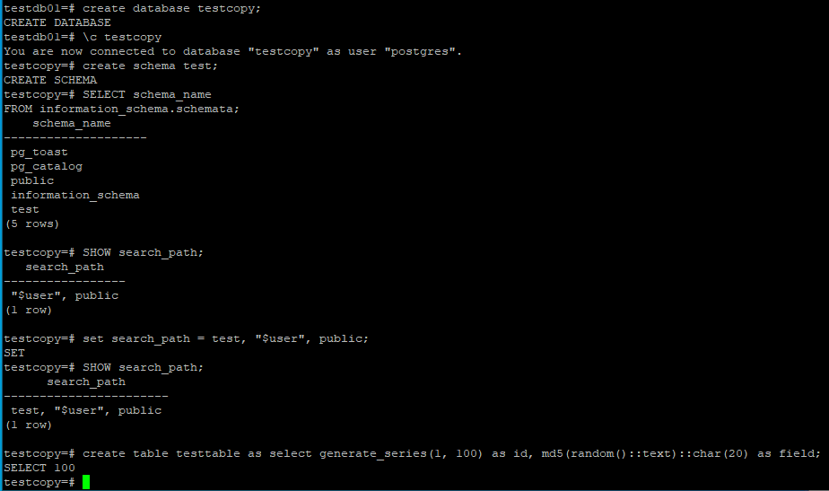  
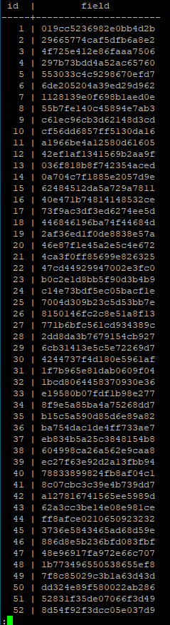  
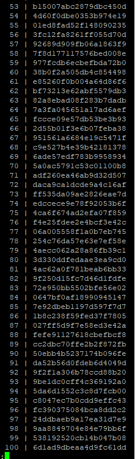  

* **Под линукс пользователем Postgres создадим каталог для бэкапов.**  
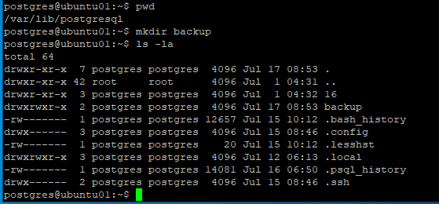  

* **Сделаем логический бэкап используя утилиту COPY.**  
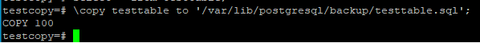  
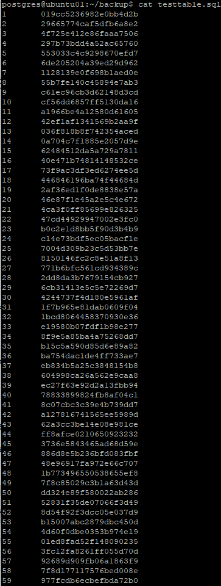  
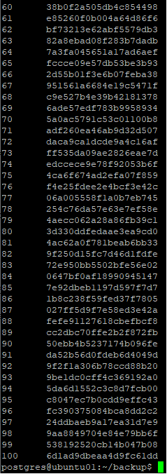  

* **Восстановим в 2 таблицу данные из бэкапа.**  
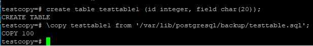  
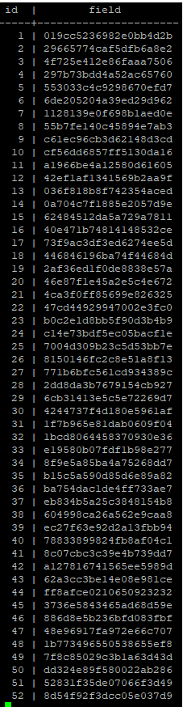  
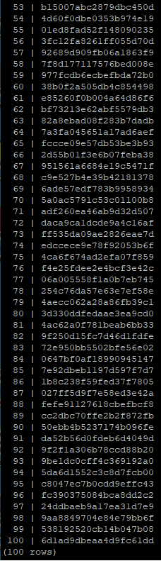  

* **Используя утилиту pg_dump создадим бэкап в кастомном сжатом формате двух таблиц.**  
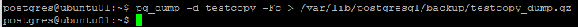  

* **Используя утилиту pg_restore восстановим в новую БД только вторую таблицу!**  
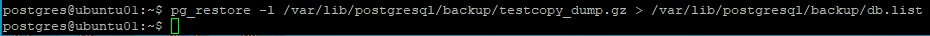  
_Выводим в файл оглавление архива._  
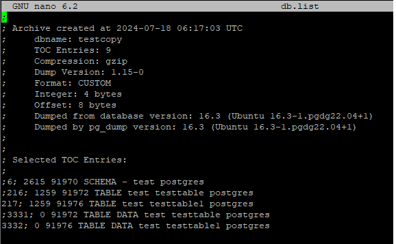  
_Комментируем лишние строки, оставляем только записи относящиеся ко второй таблице._  
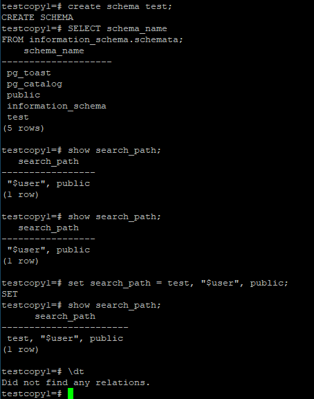  
_Создаём новую БД, схему, смотрим что таблиц пока в ней нет._  
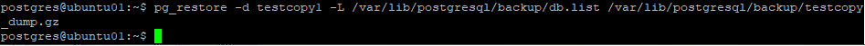  
_Восстанавливаемся из дампа с параметром -L и указываем наш файл db.list._  
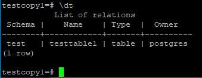  
_Проверяем что таблица появилась._  
  
  
_Так же есть вариант использовать параметр -t и указать имя нужной таблицы._  
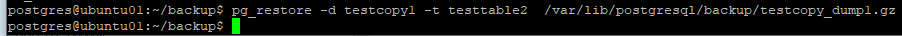  
_Пример испльзования команды, указана таблица testtable2 - это я тестировал уже на другой таблице, так же всё работает и данные загружаются._  

