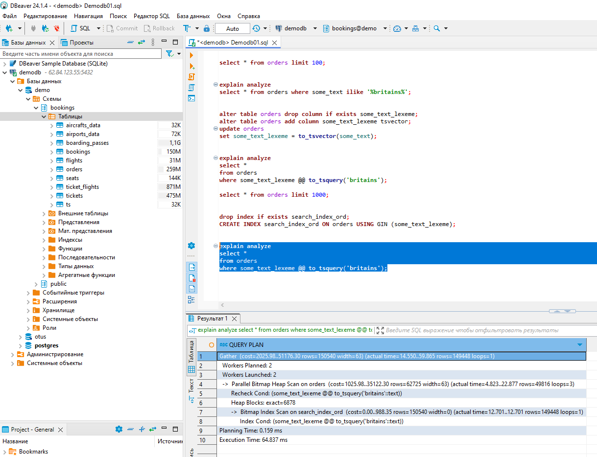

# Домашнее задание №11

* **Создать индекс к какой-либо из таблиц вашей БД. Прислать текстом результат команды explain, в которой используется данный индекс.**  
* **Реализовать индекс для полнотекстового поиска**  
* **Реализовать индекс на часть таблицы или индекс на поле с функцией**  
* **Создать индекс на несколько полей**  
* **Написать комментарии к каждому из индексов**  
* **Описать что и как делали и с какими проблемами столкнулись**  

_Создаём таблицу и проверяем план запроса к ней без индекса. (Происходит построчное сканирование таблицы - Seq Scan). Время выполнения 3.013 ms._  

_Создаём обычный индекс к таблице и проверяем план запроса к ней с индексом. 
(Происходит Index Only Scan, так как мы запросили только поле id в индексе эти данные есть и обращаться к страницам не нужно.
Так же стоит отметить значение Heap Fetches = 0 это означает что все страницы помечены в карте видимости как видимые).  Время выполнения 0.095 ms._  

_В данном случае происходит Index Scan, так как мы запросили поле col2, которое не хранится в индексе. Время выполнения 0.023 ms (мееньше чем было при Index Only Scan, что немного меня удивило)._  

_Создаём таблицу и проверяем план запроса к ней без индекса. (Происходит параллельное (в двух процессах) построчное сканирование таблицы - Seq Scan).  Время выполнения 292.331 ms._  
  
_Добавляем и заполняем поле к нашей таблице для организации полнотекстового поиска (some_text_lexeme). И пробуем поиск по нему без индекса. (План запроса похож на предыдущий, добавилась JIT компиляция и время выполнения выросло).  Время выполнения 877.252 ms._  
  
_Создаём индекс GIN по колонке some_text_lexeme и проверяем план запроса. Время выполнения 64.837 ms._  
  
_Перед созданием индекса на функцию проверим план запроса с условием на эту функцию. Время выполнения 13.425 ms._  
  
_Создаём индекс на функцию и снова смотрим план запроса. Время выполнения 0.034 ms._  
  
_Пересоздаём таблицу и смотрим план запроса с условием по двум полям. Время выполнения 4.355 ms._  
  
_Создаём составной индекс и снова смотрим план запроса с условием по двум полям. Время выполнения 0.034 ms._  
