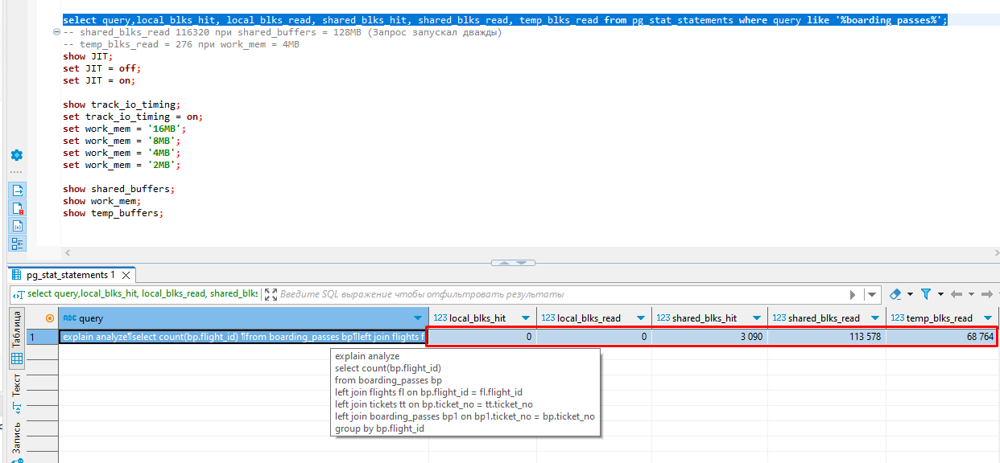

# Домашнее задание №12

* **Реализовать прямое соединение двух или более таблиц.**  
* **Реализовать левостороннее (или правостороннее) соединение двух или более таблиц.**  
* **Реализовать кросс соединение двух или более таблиц.**  
* **Реализовать полное соединение двух или более таблиц.**  
* **Реализовать запрос, в котором будут использованы разные типы соединений.**  
* **Сделать комментарии на каждый запрос.**
* **К работе приложить структуру таблиц, для которых выполнялись соединения.**
* **Задание со звездочкой. Придумайте 3 своих метрики на основе показанных представлений, отправьте их через ЛК, а так же поделитесь с коллегами в слаке.**  

  
  
  
_Создаём таблицы, заполняем их данными и пересобираем статистику по ним._  

  
  
_Делаем прямое соединение, выводим результирующую выборку и план запроса._  

_Из плана запроса видно что планировщик выбрал соединение по хешу (Hash Join)._  
_В данном случае для каждой строки таблицы model_bus по ключу хеширования (ключом хеширования являются поля участвующие в условии соединения - Hash Cond) расчитывается хеш-функции, из которых и строится хеш-таблица._  
_Затем зачитываюся строки из таблицы bus. Для каждой прочитанной строки проверяется наличие соответствующих ей строк в хеш-таблице. Найденные соответствия выводятся в результирующую выборку._  
  
  
_Делаем левостороннее соединение, выводим результирующую выборку и план запроса._  
_План запроса аналогичен предыдущему._  
  
  
_Делаем кросс соединение, выводим результирующую выборку и план запроса._  
_В данном случае планировщик предпочёл использовать соединение вложенным циклом (Nested loop)._  
_Базовый алгоритм соединения вложенным циклом таков. Во внешнем цикле перебираются строки первого набора данных (который называется внешним - в данном случае это таблица bus). Для каждой такой строки во вложенном цикле перебираются строки второго набора (который называется внутренним - в данном случае это таблица model_bus), удовлетворяющие условию соединения. Каждая найденная пара немедленно возвращается как часть результата._  
_В данном случае внутренний набор представлен узлом Materialize. Фактически этот узел возвращает полученные от нижестоящего узла строки, предварительно сохраняя их в памяти (пока размер не превышает work_mem; затем данные начинают сохраняться на диск во временный файл). При повторном обращении узел читает запомненные ранее строки, уже не обращаясь к дочернему узлу. Это позволяет не выполнять повторно сканирование всей таблицы, а прочитать только нужные строки, удовлетворяющие условию._  
  
  
_Делаем полное соединение, выводим результирующую выборку и план запроса._   
_Снова используется соединение хешированием (hash join)._  
  
  
_Делаем левостороннее соединение плюс прямое соединение, выводим результирующую выборку и план запроса._  
_Снова используется соединение хешированием (hash join). В данном случае, я полагаю, строятся две хеш-таблицы по строкам таблиц driver и model_bus. Затем зачитываются строки таблицы bus._  
_Для каждой прочитанной строки проверяется наличие соответствующих ей строк в хеш-таблицах. Найденные соответствия выводятся в результирующую выборку._
  
  
_По заданию со звёздочкой._  
_Меня заитересовали следующие метрики расширения pg stat statements:_  
_shared_blks_hit - Общее число попаданий в разделяемый кеш блоков для данного оператора._  
_shared_blks_read - Общее число чтений разделяемых блоков для данного оператора._  
_local_blks_hit - Общее число попаданий в локальный кеш блоков для данного оператора._  
_local_blks_read - Общее число чтений локальных блоков для данного оператора._  
_temp_blks_read - Общее число чтений временных блоков для данного оператора._  
  
_Метрики _shared_blks_*, соответствуют конфигурационной опции shared_buffers и позволяют выяснить, когда она недостаточная. Метрики local_blks_* соответствуют конфигурационной опции temp_buffers, а метрики temp_blks_* — опции work_mem._  
  
_На примере метрики temp_blks_read я проделал следующий эксперимент. Написал запрос к демо базе, замерил время его выполнения и какое значение записалось в столбец temp_blks_read представления pg stat statements при значениях параметра work_mem = 4MB и 80MB._
  
  
  
  
  
_При значении work_mem = 4MB время выполнения запроса = 23873.802ms, значение temp_blks_read =  68764._  
_При значении work_mem = 80MB время выполнения запроса = 10745.128ms, значение temp_blks_read =  0._  
_Таким образом, метрика temp_blks_read даёт нам понимание достаточно ли мы выделили памяти для выполнения того или иного запроса в параметре work_mem. Если значение temp_blks_read больше нуля, то, как я понял, системе приходится использовать чтение с диска, что может (должно по логике) замедлять выполнение отпредлённых запросов._  
_Предполагаю, что метрики shared_blks_read и local_blks_read можно использовать подобным образом._  

