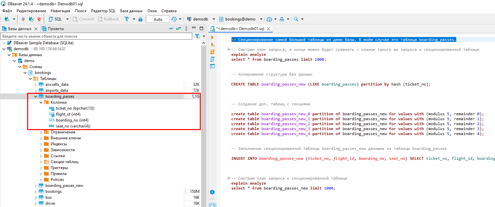
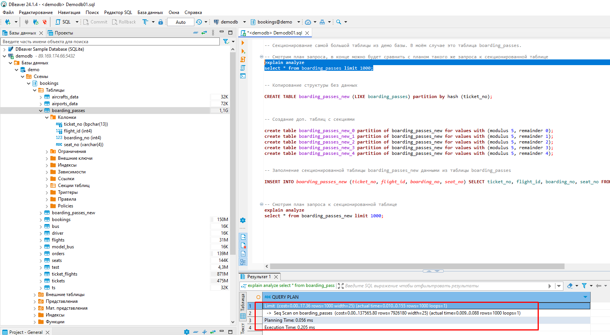
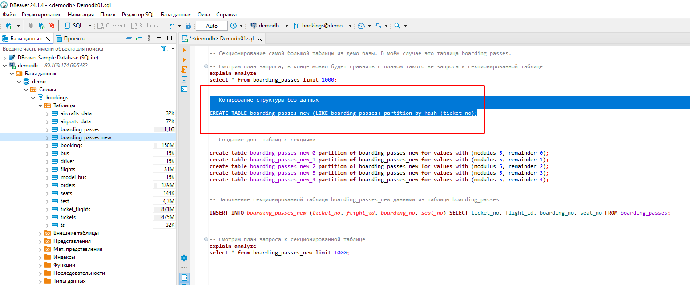
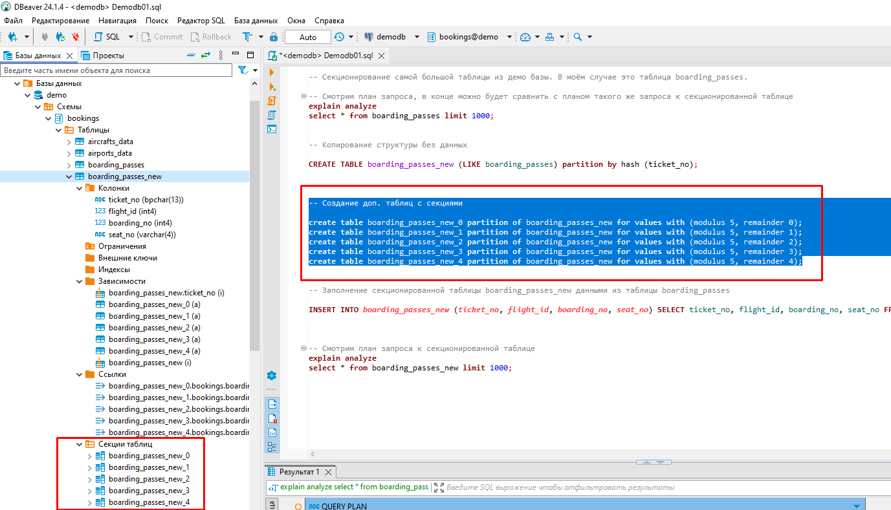
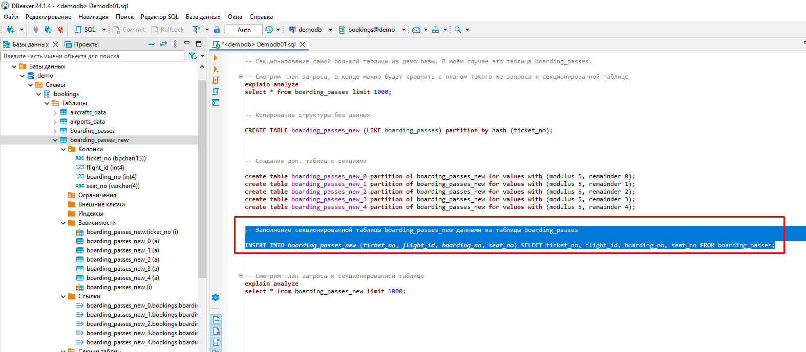
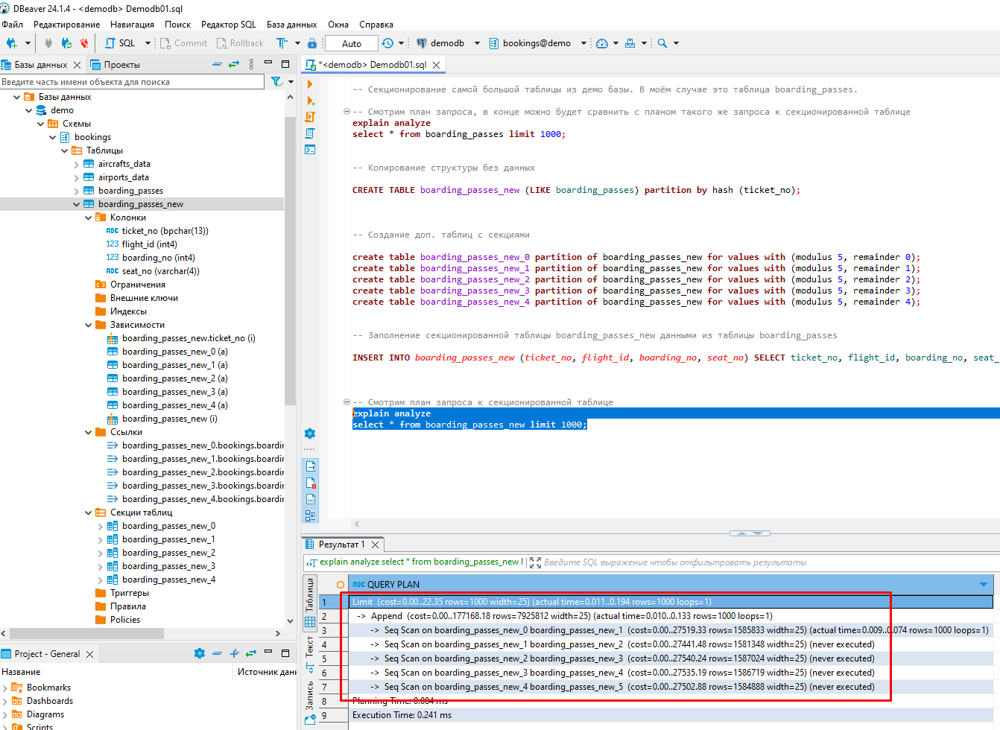
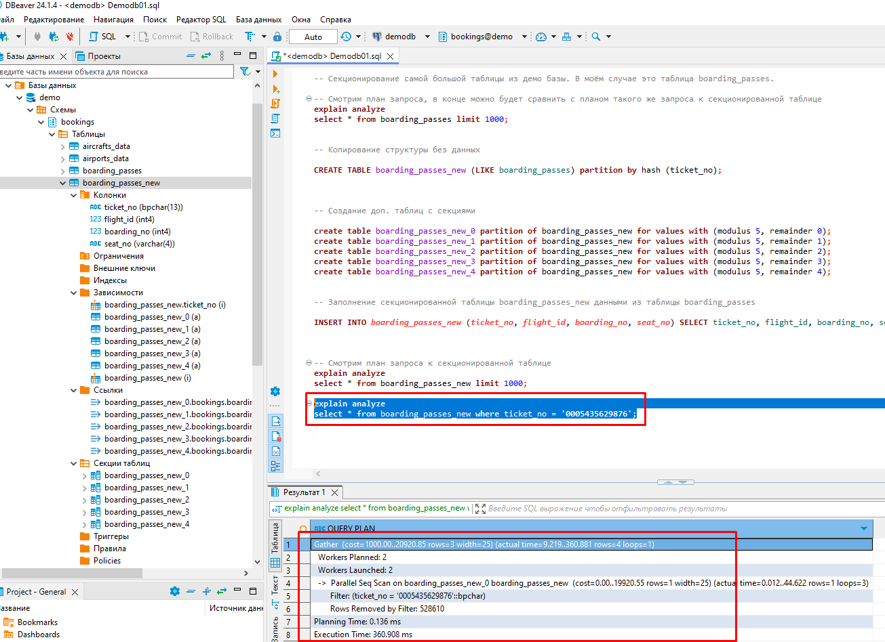
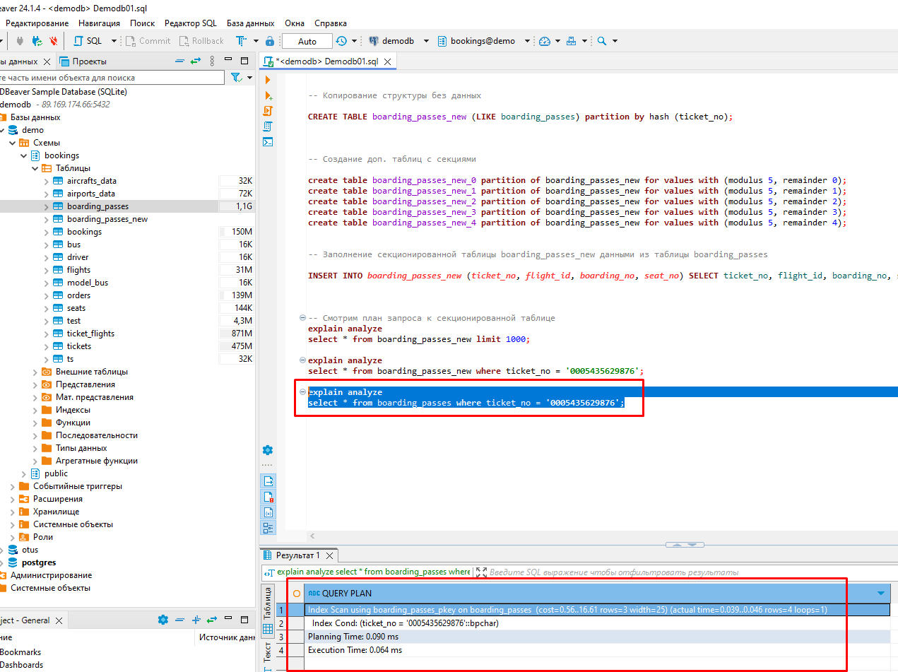
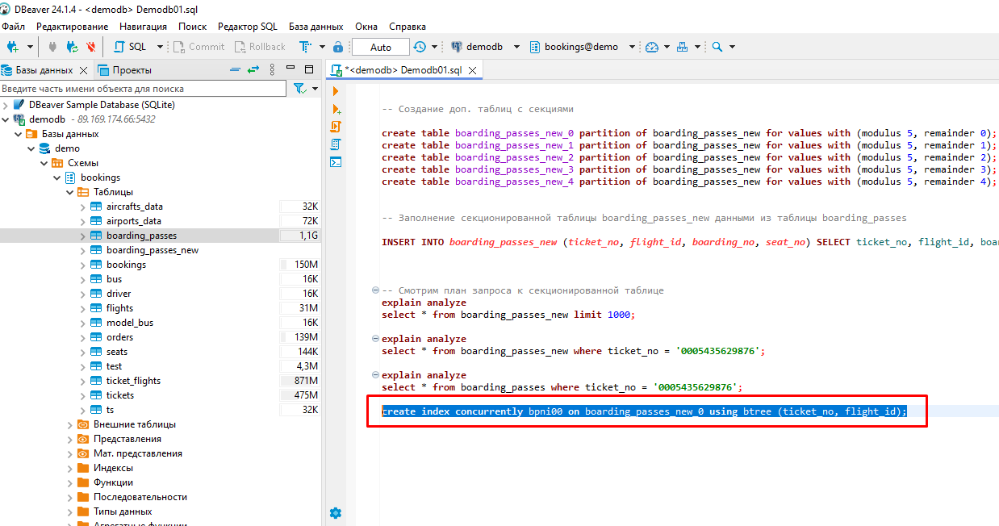
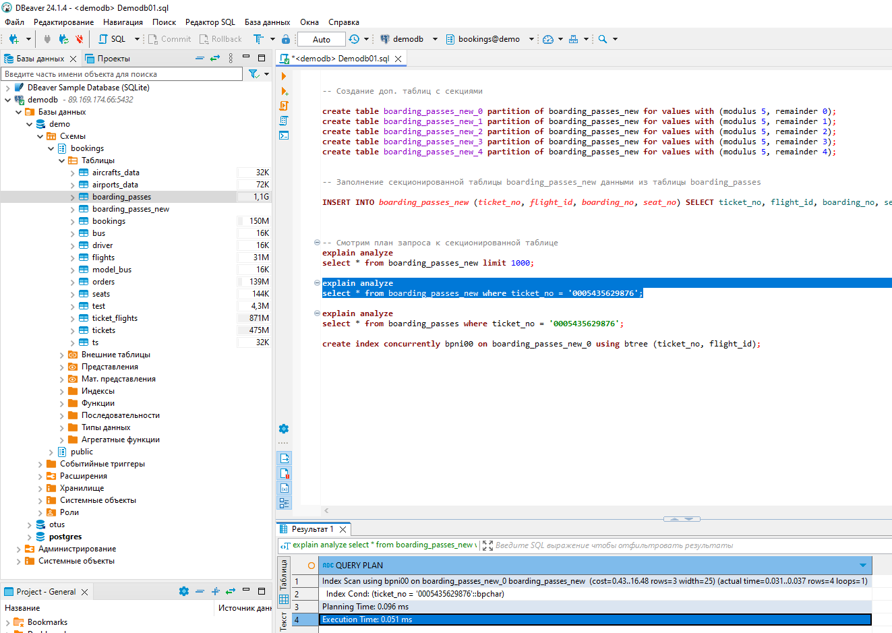

# Домашнее задание №13

* **Секционировать большую таблицу из демо базы flights.**  

  
_Секционировать будем таблицу boarding_passes, точнее её копию._  
  
  
_Выведем для сравнения план запроса к таблице boarding_passes. В конце его можно будет сравнить с планом такого же запроса к секционированной таблице._  
  
  
_Создаём секционированную по хешу таблицу boarding_passes_new со структурой таблицы boarding_passes._  
  
  
_Создаём пять дополнительных таблиц, которые будут являться секциями таблицы boarding_passes_new._  
  
  
_Заполним таблицу boarding_passes_new данными из таблицы boarding_passes._  
  
  
_Смотрим план запроса к секционированной таблице. Видно, что происходит сканирование всех пяти секционных таблиц._  
  
  
_Для примера посмотрим ещё один план запроса к секционированной таблице. Видно, что в данном случае достаточно сканирования одной секционной таблицы._  
  
  
_Подобный запрос к таблице boarding_passes будет использовать индексное сканирование. В таблице boarding_passes_new мы не можем создавать индексы, но можем их создавать в её секционных таблицах._  
  
  
_Создаём индекс в таблице boarding_passes_new_0._  
  
  
_Снова смотрим план запроса к таблице boarding_passes_new. Видим, что теперь так же происходит индексное сканирование._  
