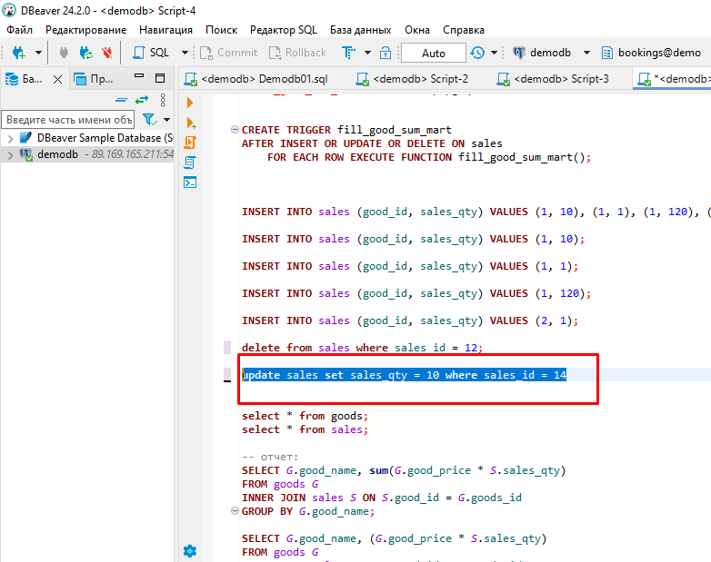
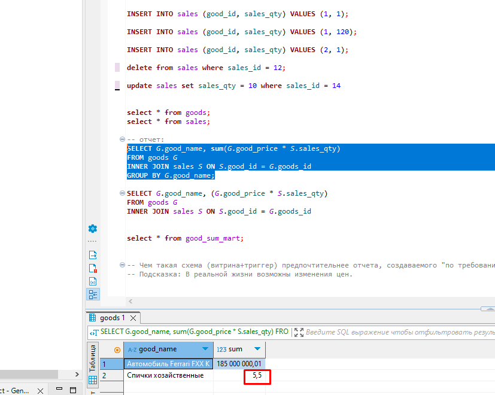
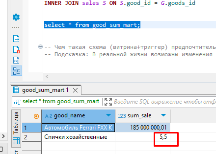

# Домашнее задание №14

* **Создать триггер для поддержки витрины в актуальном состоянии.**  

  
_Создаём и заполняем данными таблицу с товарами._  
  
  
_Создаём таблицу с продажами._  
  
  
_Создаём таблицу, которая будет выполнять роль витрины._  
  
  
_Создаём триггерную функцию._  
  
  
_Создаём сам триггер._  
  
  
_Делаем несколько вставок в таблицу с продажами._  
  
  
_Смотрим что выводится в отчёте._  
  
  
_Смотрим что содержит наша витринная таблица и видим что данные совпадают, следовательно наш триггер работает как задумано._  
  
  
_Удалим запись из таблицы продаж._  
  
  
_Смотрим что выводится в отчёте._  

  
_Смотрим что содержит наша витринная таблица и видим что данные совпадают, следовательно наш триггер работает как задумано._  

  
_Изменим поле sales_qty в таблице продаж._  

  
_Смотрим что выводится в отчёте._  

  
_Смотрим что содержит наша витринная таблица и видим что данные совпадают, следовательно наш триггер работает как задумано._  

* **Задание со звездочкой**  
* **Чем такая схема (витрина+триггер) предпочтительнее отчета, создаваемого "по требованию" (кроме производительности)?**  
* **Подсказка: В реальной жизни возможны изменения цен.**  

 _Очевидно, что плюс данного подхода (кроме повышения производительности) состоит в том, что при изменении цены на товар в таблице goods, в нашей витринной таблице данные будут отражать реальную историческую действительность. В то время как в отчётё будет тянуться последняя введённая цена._  

