# Домашнее задание №14

* **Создать триггер для поддержки витрины в актуальном состоянии.**  

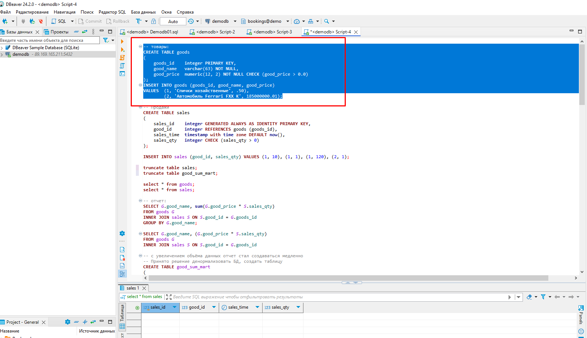  
_Создаём и заполняем данными таблицу с товарами._  
  
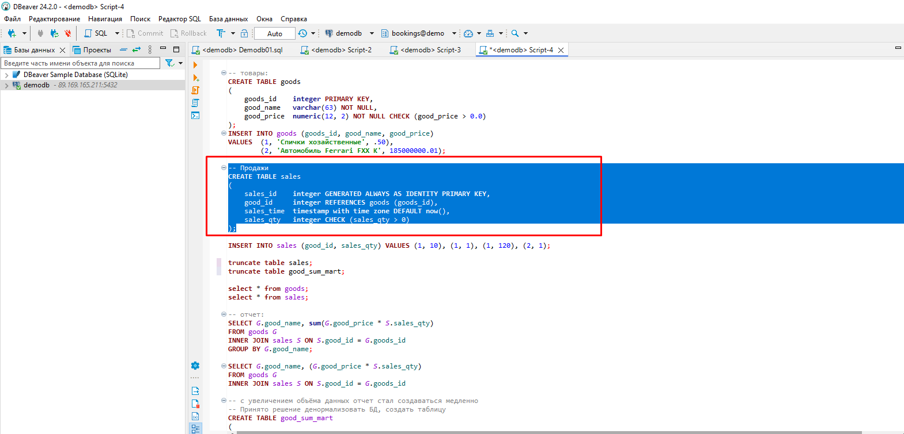  
_Создаём таблицу с продажами._  
  
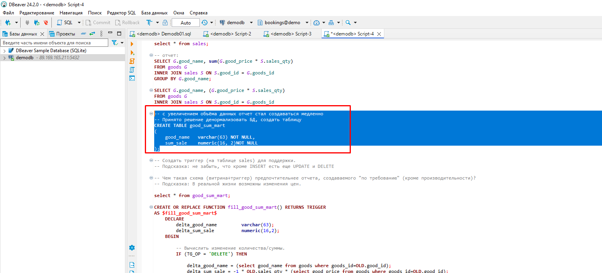  
_Создаём таблицу, которая будет выполнять роль витрины._  
  
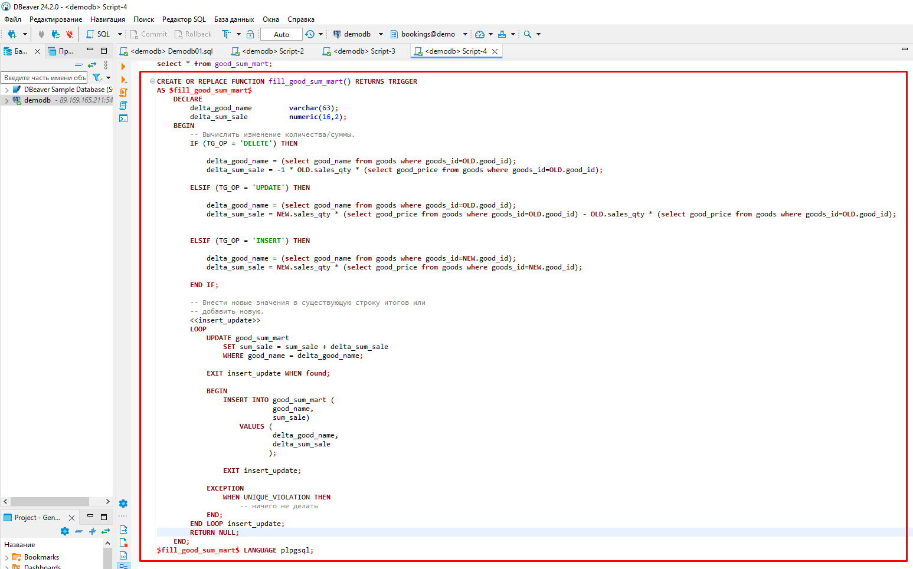  
_Создаём триггерную функцию._  
  
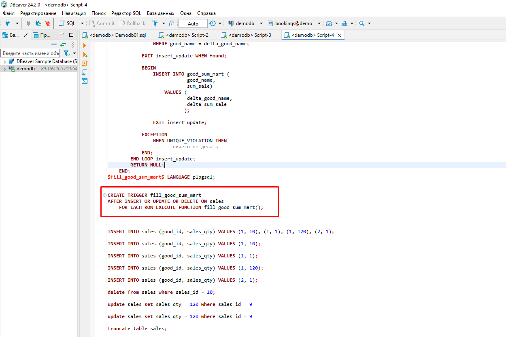  
_Создаём сам триггер._  
  
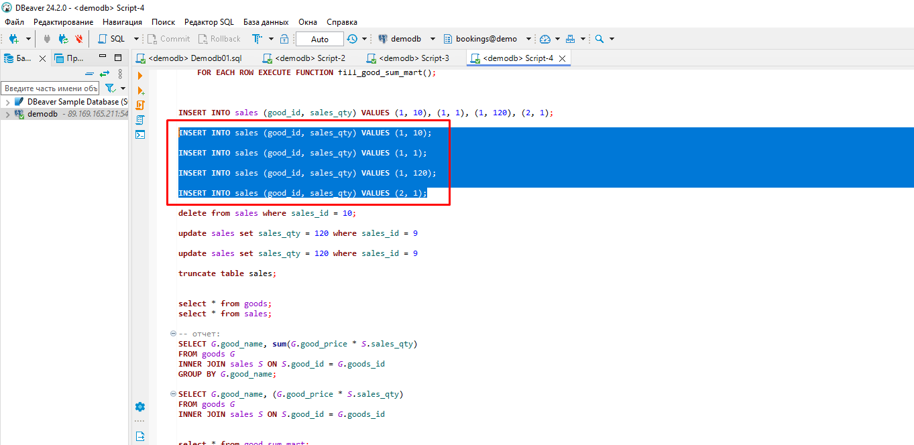  
_Делаем несколько вставок в таблицу с продажами._  
  
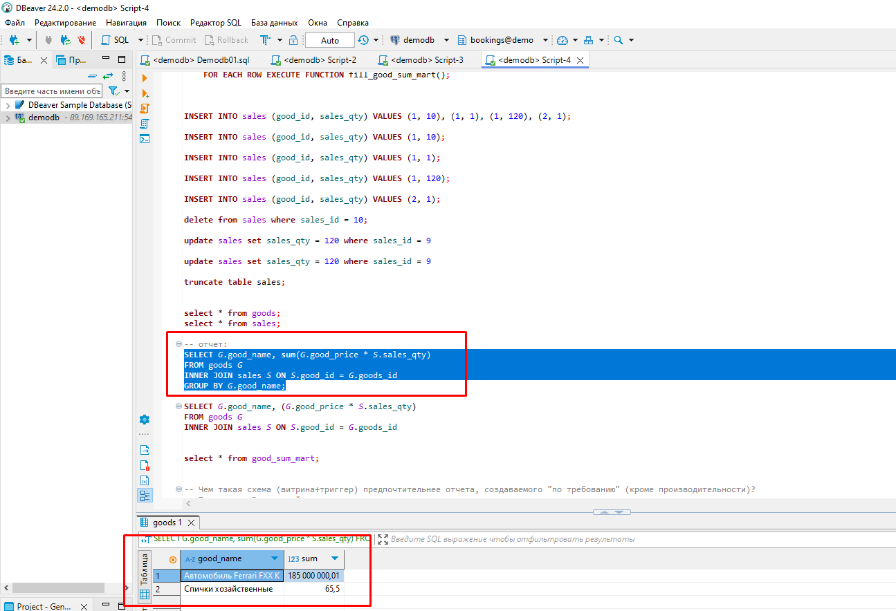  
_Смотрим что выводится в отчёте._  
  
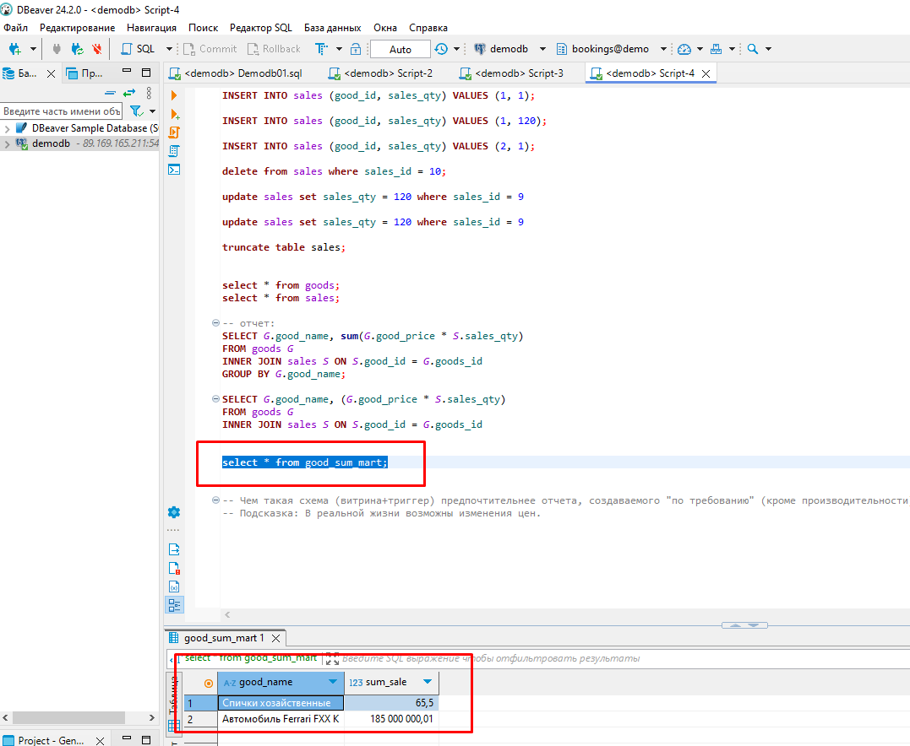  
_Смотрим что содержит наша витринная таблица._  
  
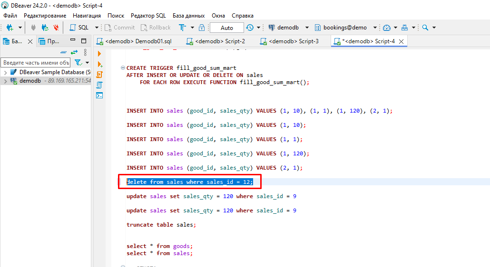  
_Удалим запись из таблицы продаж._  
  
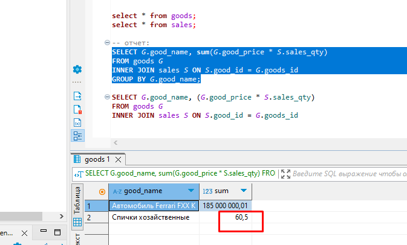  
_Смотрим что выводится в отчёте._  

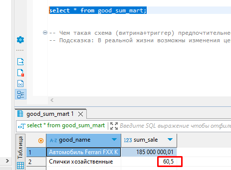  
_Смотрим что содержит наша витринная таблица._  
