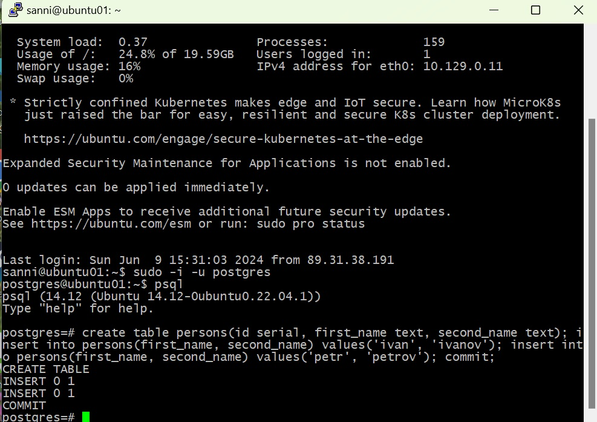

# Домашнее задание №2

*	**создать ВМ с Ubuntu 20.04/22.04 или развернуть докер любым удобным способом**
*	**поставить на нем Docker Engine**
*	**сделать каталог /var/lib/postgres**
*	**развернуть контейнер с PostgreSQL 15 смонтировав в него /var/lib/postgresql**
*	**развернуть контейнер с клиентом postgres**
*	**подключится из контейнера с клиентом к контейнеру с сервером и сделать таблицу с парой строк**
*	**подключится к контейнеру с сервером с ноутбука/компьютера извне инстансов GCP/ЯО/места установки докера**
*	**удалить контейнер с сервером**
*	**создать его заново**
*	**подключится снова из контейнера с клиентом к контейнеру с сервером**
*	**проверить, что данные остались на месте**
*	**оставляйте в ЛК ДЗ комментарии что и как вы делали и как боролись с проблемами**

Создана виртуальная машина c Ubuntu 22.04 LTS на Яндекс Облаке.

В Ubuntu cозданы два пользователя: sanni и testuser. Для каждого сгенерированы пары ключей для подключения по ssh.

Подключение к ВМ по ssh идёт через программу Putty.

Установлен PostgreSQL. 
Везде запущен psql из под пользователя postgres

*	**выключить auto commit**

С этим пунктом я немного повозился, просто командой в терминале мне не удалось отключить AUTOCOMMIT.
Пробовал команды:
set AUTOCOMMIT OFF;
\set AUTOCOMMIT OFF;
и их вариации, но они не срабатывали.
В итоге отключил через файл ~/.psqlrc, создав в нём запись:

Просьба научить как это делается. И какой командой в терминале можно увидеть статус у AUTOCOMMIT (ON или OFF)?

*	**сделать
в первой сессии новую таблицу и наполнить ее данными create table persons(id serial, first_name text, second_name text); insert into persons(first_name, second_name) values('ivan', 'ivanov'); insert into persons(first_name, second_name) values('petr', 'petrov'); commit;**

*	**посмотреть текущий уровень изоляции: show transaction isolation level**

*	**начать новую транзакцию в обоих сессиях с дефолтным (не меняя) уровнем изоляции**
*	**в первой сессии добавить новую запись insert into persons(first_name, second_name) values('sergey', 'sergeev');**

*	**сделать select from persons во второй сессии**

*	**видите ли вы новую запись и если да то почему?**

Запись не вижу, так как уровень изоляции транзакций установлен в READ COMMITTED (Чтение подтвержденных данных) Транзакции видят только подтвержденные изменения других транзакций и настройка AUTOCOMMIT переведена в OFF
*	**завершить первую транзакцию - commit;**

*	**сделать select from persons во второй сессии**

*	**видите ли вы новую запись и если да то почему?**

Запись вижу, так как мы только что завершили транзакцию принудительно командой commit и теперь другие транзакции с уровнем изоляции READ COMMITTED могут видеть данные подтвержденные данной транзакцией.
*	**завершите транзакцию во второй сессии**
*	**начать новые но уже repeatable read транзации - set transaction isolation level repeatable read;**

*	**в первой сессии добавить новую запись insert into persons(first_name, second_name) values('sveta', 'svetova');**

*	**сделать select from persons во второй сессии**

*	**видите ли вы новую запись и если да то почему?**

Новую запись не вижу, так как: REPEATABLE READ (Повторяемое чтение): В этом режиме транзакции видят только данные, которые были считаны на момент начала транзакции.
*	**завершить первую транзакцию - commit;**
*	**сделать select from persons во второй сессии**

*	**видите ли вы новую запись и если да то почему?**

Новую запись не вижу, так как: REPEATABLE READ (Повторяемое чтение): В этом режиме транзакции видят только данные, которые были считаны на момент начала транзакции.
*	**завершить вторую транзакцию**
*	**сделать select * from persons во второй сессии**

*	**видите ли вы новую запись и если да то почему?**

Запись вижу. Так как транзакция с уровнем изоляции REPEATABLE READ во второй сессии была завершена и теперь мы видим данные зафиксированные транзакцией из первой сессии.
