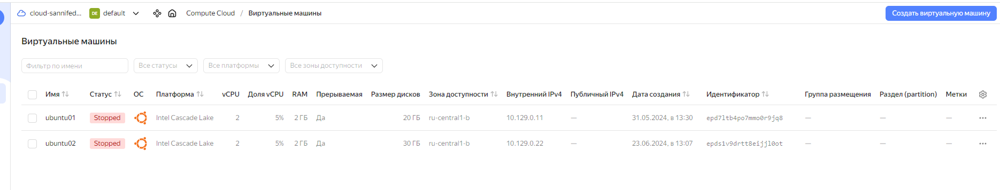

# Домашнее задание №3

*	**создайте виртуальную машину c Ubuntu 20.04/22.04 LTS в GCE/ЯО/Virtual Box/докере**
*	**поставьте на нее PostgreSQL 15 через sudo apt**
*	**проверьте что кластер запущен через sudo -u postgres pg_lsclusters**
*	**зайдите из под пользователя postgres в psql и сделайте произвольную таблицу с произвольным содержимым
postgres=# create table test(c1 text);
postgres=# insert into test values('1');
\q**
*	**остановите postgres например через sudo -u postgres pg_ctlcluster 15 main stop**
*	**создайте новый диск к ВМ размером 10GB**
*	**добавьте свеже-созданный диск к виртуальной машине - надо зайти в режим ее редактирования и дальше выбрать пункт attach existing disk**
*	**проинициализируйте диск согласно инструкции и подмонтировать файловую систему, только не забывайте менять имя диска на актуальное, в вашем случае это скорее всего будет /dev/sdb - https://www.digitalocean.com/community/tutorials/how-to-partition-and-format-storage-devices-in-linux**
*	**перезагрузите инстанс и убедитесь, что диск остается примонтированным (если не так смотрим в сторону fstab)**
*	**сделайте пользователя postgres владельцем /mnt/data - chown -R postgres:postgres /mnt/data/**
*	**перенесите содержимое /var/lib/postgres/15 в /mnt/data - mv /var/lib/postgresql/15/mnt/data**
*	**попытайтесь запустить кластер - sudo -u postgres pg_ctlcluster 15 main start**
*	**напишите получилось или нет и почему**
*	**задание: найти конфигурационный параметр в файлах раположенных в /etc/postgresql/15/main который надо поменять и поменяйте его**
*	**напишите что и почему поменяли**
*	**попытайтесь запустить кластер - sudo -u postgres pg_ctlcluster 15 main start**
*	**напишите получилось или нет и почему**
*	**зайдите через через psql и проверьте содержимое ранее созданной таблицы**
*	**задание со звездочкой: не удаляя существующий инстанс ВМ сделайте новый, поставьте на его PostgreSQL, удалите файлы с данными из /var/lib/postgres, перемонтируйте внешний диск который сделали ранее от первой виртуальной машины ко второй и запустите PostgreSQL на второй машине так чтобы он работал с данными на внешнем диске, расскажите как вы это сделали и что в итоге получилось.**

Создана виртуальная машина c Ubuntu 22.04 LTS на Яндекс Облаке.

На ней установлен Docker Engine.

Создан каталог /var/lib/postgres.

Создана docker-сеть и развернут контейнер с PostgreSQL 15 (каталог с данными контейнера ((/var/lib/postgresql/data)) смонтирован в созданный каталог в ОС (/var/lib/postgres)).

Развернут контейнер с клиентом postgres.

Подключился из контейнера с клиентом к контейнеру с сервером, создал базу данных otus и таблицу в ней test с парой строк.

Подключится к контейнеру со своего домашнего ноутбука с Windows 11, преварительно установив на него PostgreSQL.

Видно, что есть проблемы с кодовой страницей, решение известно, в рамках данного ДЗ не стал исправлять.

Удалил контейнер с сервером.  
Создал его заново.  
Подключился снова из контейнера с клиентом к контейнеру с сервером.  
Проверил - данные на месте.

По поводу проблем с выполнением, их не было. Единственное, примерно на середине выполнения мне понадобилось отлучится и я погасил инстанс с ВМ. После того как поднял ВМ увидел что контейнер с сервером виден, но создать контейнер с клиентом снова не давало с оишбкой:

Сообразил что контейнер с сервером остановился и запустил его командой sudo docker start ID контейнера.

