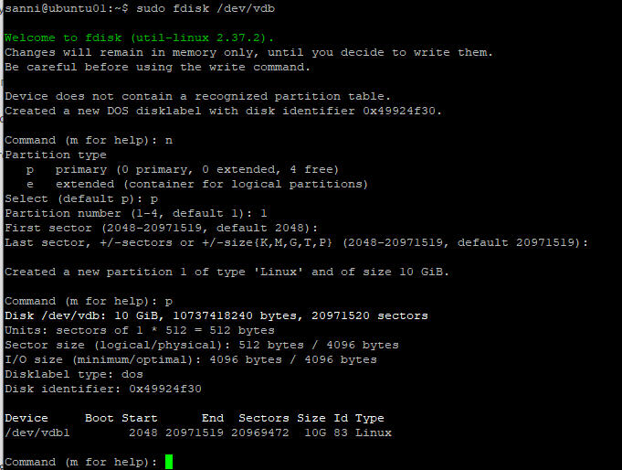
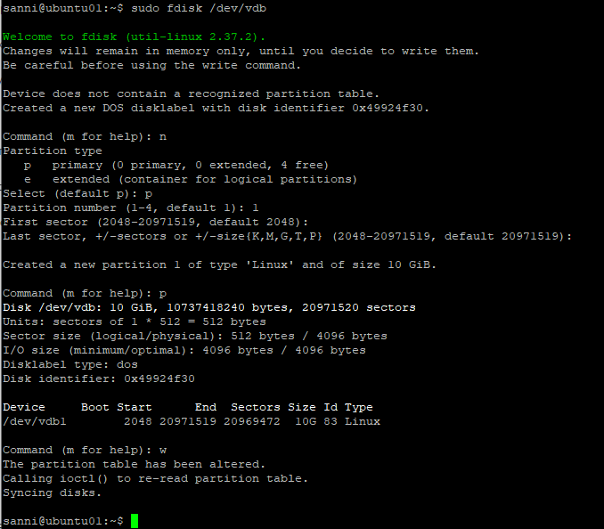
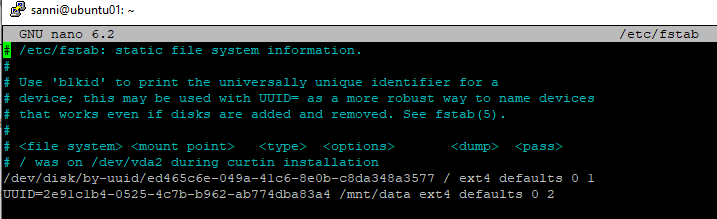
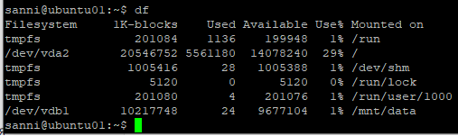
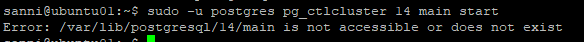
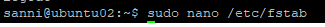

# Домашнее задание №3

*	**создайте виртуальную машину c Ubuntu 20.04/22.04 LTS в GCE/ЯО/Virtual Box/докере**
*	**поставьте на нее PostgreSQL 15 через sudo apt**
*	**проверьте что кластер запущен через sudo -u postgres pg_lsclusters**
*	**зайдите из под пользователя postgres в psql и сделайте произвольную таблицу с произвольным содержимым
postgres=# create table test(c1 text);
postgres=# insert into test values('1');
\q**
*	**остановите postgres например через sudo -u postgres pg_ctlcluster 15 main stop**
*	**создайте новый диск к ВМ размером 10GB**
*	**добавьте свеже-созданный диск к виртуальной машине - надо зайти в режим ее редактирования и дальше выбрать пункт attach existing disk**
*	**проинициализируйте диск согласно инструкции и подмонтировать файловую систему, только не забывайте менять имя диска на актуальное, в вашем случае это скорее всего будет /dev/sdb - https://www.digitalocean.com/community/tutorials/how-to-partition-and-format-storage-devices-in-linux**
*	**перезагрузите инстанс и убедитесь, что диск остается примонтированным (если не так смотрим в сторону fstab)**
*	**сделайте пользователя postgres владельцем /mnt/data - chown -R postgres:postgres /mnt/data/**
*	**перенесите содержимое /var/lib/postgres/15 в /mnt/data - mv /var/lib/postgresql/15/mnt/data**
*	**попытайтесь запустить кластер - sudo -u postgres pg_ctlcluster 15 main start**
*	**напишите получилось или нет и почему**
*	**задание: найти конфигурационный параметр в файлах раположенных в /etc/postgresql/15/main который надо поменять и поменяйте его**
*	**напишите что и почему поменяли**
*	**попытайтесь запустить кластер - sudo -u postgres pg_ctlcluster 15 main start**
*	**напишите получилось или нет и почему**
*	**зайдите через через psql и проверьте содержимое ранее созданной таблицы**
*	**задание со звездочкой: не удаляя существующий инстанс ВМ сделайте новый, поставьте на его PostgreSQL, удалите файлы с данными из /var/lib/postgres, перемонтируйте внешний диск который сделали ранее от первой виртуальной машины ко второй и запустите PostgreSQL на второй машине так чтобы он работал с данными на внешнем диске, расскажите как вы это сделали и что в итоге получилось.**

Созданы две виртуальные машины c Ubuntu 22.04 LTS на Яндекс Облаке (ubuntu01 и ubuntu02).

На них усановлены PostgreSQL 14 (преподаватель данного урока разрешил ставить версию PostgreSQL на наше усмотрение, на суть это не влияет) через sudo apt.
Проверьте что кластер запущен через sudo -u postgres pg_lsclusters

Зайдите из под пользователя postgres в psql и сделайте произвольную таблицу с произвольным содержимым.  
postgres=# create table test(c1 text);  
postgres=# insert into test values('1');  
\q  

Остановите postgres например через sudo -u postgres pg_ctlcluster 15 main stop.

Создайте новый диск к ВМ размером 10GB.

Для подключения диска я использовал инструкцию от яндекса: https://yandex.cloud/ru/docs/compute/operations/vm-control/vm-attach-disk?utm_referrer=https%3A%2F%2Fwww.google.com%2F  

Добавьте свеже-созданный диск к виртуальной машине - надо зайти в режим ее редактирования и дальше выбрать пункт attach existing disk.  

Данная комадна запускалась до и после присоединения нового диска. Появившийся диск выделен рамочкой.  

Так же посмотрел что выдаёт команда: sudo fdisk -l  

  
На основании этой информации сделал вывод, что наш новый диск определился в системе как /dev/vdb.  

Затем той же утилитой fdisk создал раздел, сделал его основным, указал ему номер 1.

Отформатировал раздел в файловую систему ext4.  

Создал каталог /mnt/data, сделал пользователя postgres его владельцем, смонтировал в него наш раздел. Узнал UUID раздела и прописал его в /etc/fstab.

Проверил состояние файловых систем.  

Перегрузил ВМ и снова проверил.  

Остановил postgres например через sudo -u postgres pg_ctlcluster 14 main stop.

Перенёс содержимое /var/lib/postgres/14 в /mnt/data - mv /var/lib/postgresql/14/mnt/data.  

Попытайтесь запустить кластер - sudo -u postgres pg_ctlcluster 14 main start.
  
Выдаёт ошибку, так как не может зачитать каталог с базами данных.

Задание: найти конфигурационный параметр в файлах раположенных в /etc/postgresql/14/main который надо поменять и поменяйте его.  
Нужно внести правку в файл /etc/postgresql/14/main/postgresql.conf:  

После этого кластер поднимется и видно что директория с данными теперь используется другая - /mnt/data/14/main:  

Можно зайти и проверить, что данные на месте:  

Далее пропишем в etc/fstab UUID раздела, что бы после перезагрузки всё работало, перезагрузим ВМ и проверим:
  
  
  

