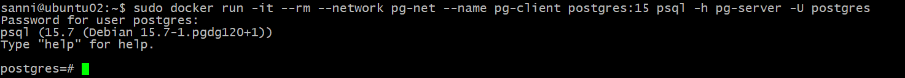
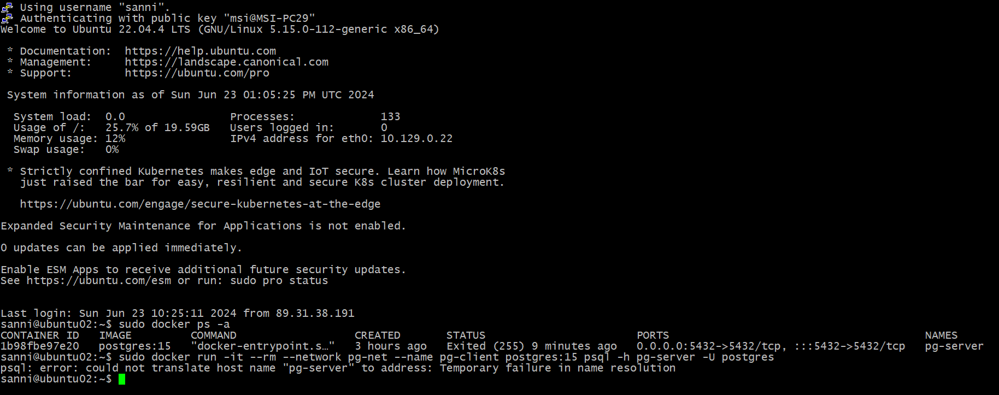

# Домашнее задание №2

*	**создать ВМ с Ubuntu 20.04/22.04 или развернуть докер любым удобным способом**
*	**поставить на нем Docker Engine**
*	**сделать каталог /var/lib/postgres**
*	**развернуть контейнер с PostgreSQL 15 смонтировав в него /var/lib/postgresql**
*	**развернуть контейнер с клиентом postgres**
*	**подключится из контейнера с клиентом к контейнеру с сервером и сделать таблицу с парой строк**
*	**подключится к контейнеру с сервером с ноутбука/компьютера извне инстансов GCP/ЯО/места установки докера**
*	**удалить контейнер с сервером**
*	**создать его заново**
*	**подключится снова из контейнера с клиентом к контейнеру с сервером**
*	**проверить, что данные остались на месте**
*	**оставляйте в ЛК ДЗ комментарии что и как вы делали и как боролись с проблемами**

Создана виртуальная машина c Ubuntu 22.04 LTS на Яндекс Облаке.

На ней установлен Docker Engine.

Создан каталог /var/lib/postgres.

Создана docker-сеть и развернут контейнер с PostgreSQL 15 (каталог с данными контейнера ((/var/lib/postgresql/data)) смонтирован в созданный каталог в ОС (/var/lib/postgres)).

Развернут контейнер с клиентом postgres.

Подключился из контейнера с клиентом к контейнеру с сервером, создал базу данных otus и таблицу в ней test с парой строк.

Подключится к контейнеру со своего домашнего ноутбука с Windows 11, преварительно установив на него PostgreSQL.

Видно, что есть проблемы с кодовой страницей, решение известно, в рамках данного ДЗ не стал исправлять.

Удалил контейнер с сервером.  
Создал его заново.  
Подключился снова из контейнера с клиентом к контейнеру с сервером.  
Проверил - данные на месте.

По поводу проблем с выполнением, их не было. Единственное, примерно на середине выполнения мне понадобилось отлучится и я погасил инстанс с ВМ. После того как поднял ВМ увидел что контейнер с сервером виден, но создать контейнер с клиентом снова не давало с оишбкой:

Сообразил что контейнер с сервером остановился и запустил его командой sudo docker start ID контейнера.

