# Домашнее задание №4

*	**создайте новый кластер PostgresSQL 14**
*	**зайдите в созданный кластер под пользователем postgres**
*	**создайте новую базу данных testdb**
*	**зайдите в созданную базу данных под пользователем postgres**
*	**создайте новую схему testnm**
*	**создайте новую таблицу t1 с одной колонкой c1 типа integer**
*	**вставьте строку со значением c1=1**
*	**создайте новую роль readonly**
*	**дайте новой роли право на подключение к базе данных testdb**
*	**дайте новой роли право на использование схемы testnm**
*	**дайте новой роли право на select для всех таблиц схемы testnm**
*	**создайте пользователя testread с паролем test123**
*	**дайте роль readonly пользователю testread**
*	**зайдите под пользователем testread в базу данных testdb**
*	**сделайте select * from t1;**
*	**получилось? (могло если вы делали сами не по шпаргалке и не упустили один существенный момент про который позже)**
*	**напишите что именно произошло в тексте домашнего задания**
*	**у вас есть идеи почему? ведь права то дали?**
*	**посмотрите на список таблиц**
*	**подсказка в шпаргалке под пунктом 20**
*	**а почему так получилось с таблицей (если делали сами и без шпаргалки то может у вас все нормально)**
*	**вернитесь в базу данных testdb под пользователем postgres**
*	**удалите таблицу t1**
*	**создайте ее заново но уже с явным указанием имени схемы testnm**
*	**вставьте строку со значением c1=1**
*	**зайдите под пользователем testread в базу данных testdb**
*	**сделайте select * from testnm.t1;**
*	**получилось?**
*	**есть идеи почему? если нет - смотрите шпаргалку**
*	**как сделать так чтобы такое больше не повторялось? если нет идей - смотрите шпаргалку**
*	**сделайте select * from testnm.t1;**
*	**получилось?**
*	**есть идеи почему? если нет - смотрите шпаргалку**
*	**сделайте select * from testnm.t1;**
*	**получилось?**
*	**ура!**
*	**теперь попробуйте выполнить команду create table t2(c1 integer); insert into t2 values (2);**
*	**а как так? нам же никто прав на создание таблиц и insert в них под ролью readonly?**
*	**есть идеи как убрать эти права? если нет - смотрите шпаргалку**
*	**если вы справились сами то расскажите что сделали и почему, если смотрели шпаргалку - объясните что сделали и почему выполнив указанные в ней команды**
*	**теперь попробуйте выполнить команду create table t3(c1 integer); insert into t2 values (2);**
*	**расскажите что получилось и почему**

создайте новый кластер PostgresSQL 14.
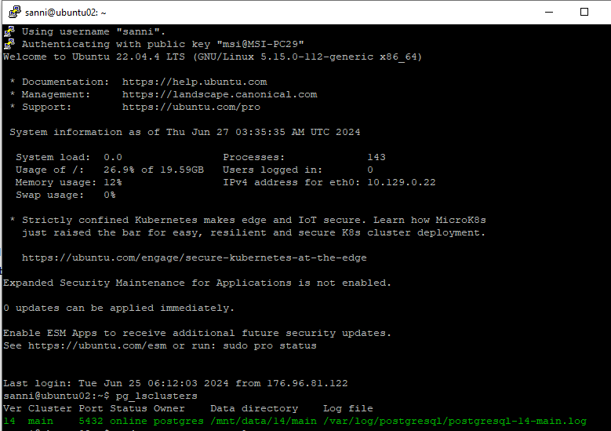

зайдите в созданный кластер под пользователем postgres.
создайте новую базу данных testdb.
зайдите в созданную базу данных под пользователем postgres.  
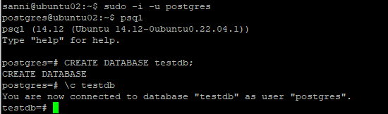

создайте новую схему testnm.
создайте новую таблицу t1 с одной колонкой c1 типа integer.
вставьте строку со значением c1=1.
создайте новую роль readonly.
дайте новой роли право на подключение к базе данных testdb.
дайте новой роли право на использование схемы testnm.
дайте новой роли право на select для всех таблиц схемы testnm.
создайте пользователя testread с паролем test123.
дайте роль readonly пользователю testread.  
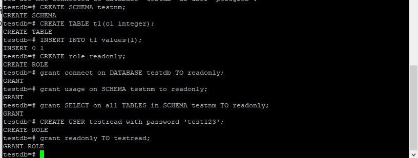

зайдите под пользователем testread в базу данных testdb.  
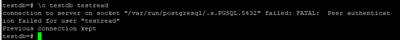  
Для того чтобы не было данной ошибки поправил файл pg_hba.conf.  
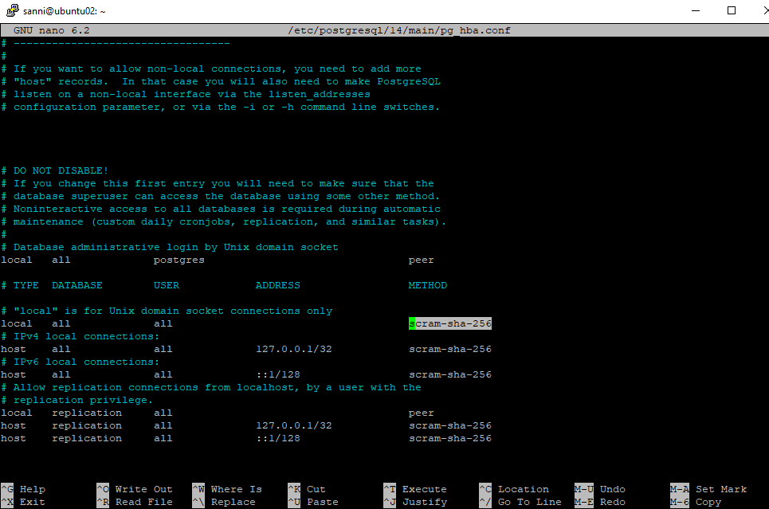  
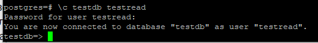

сделайте select * from t1;.
получилось? (могло если вы делали сами не по шпаргалке и не упустили один существенный момент про который позже).
напишите что именно произошло в тексте домашнего задания.
у вас есть идеи почему? ведь права то дали?
посмотрите на список таблиц.
подсказка в шпаргалке под пунктом 20
а почему так получилось с таблицей (если делали сами и без шпаргалки то может у вас все нормально)  
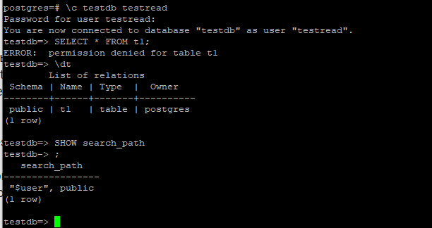  
Делал по шпаргалке, так как очень экономит время. Выдало ошибку. Нет прав, потому что таблица создалась в схеме public. На эту схемы у роли readonly нет прав.
Создалось в public так как в search_path лежит "$user", public. Первый элемент ($user) ссылается на схему с именем текущего пользователя, то есть, как я понимаю, если бы назвали нашу схему не testnm, а по имени пользователя - testread то таблица бы сохранилась в этой схеме и ошибки бы не было (естественно, при условии наличая прав у группы readonly на схему testread). Плюсом к этому, ошибки так же бы не было если бы мы не сменили роль нашего пользователя на readonly. По-умолчанию ему присвоилась роль public, которая имеет права на все действия со схемой public (где и создалась в данном примере наша таблица).

вернитесь в базу данных testdb под пользователем postgres.
удалите таблицу t1.
создайте ее заново но уже с явным указанием имени схемы testnm.
вставьте строку со значением c1=1.
зайдите под пользователем testread в базу данных testdb.
сделайте select * from testnm.t1;.  
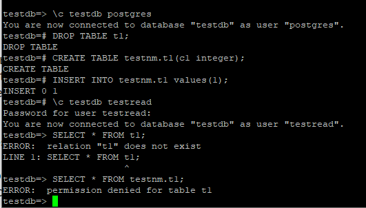  

получилось?  
- нет  
есть идеи почему? если нет - смотрите шпаргалку  
  тут я догадался сам, на вновь созданные таблицы мы не давали прав.  
как сделать так чтобы такое больше не повторялось? если нет идей - смотрите шпаргалку  
  для возможности доступа к вновь создаваемым таблицам нужно прописать следующие права:  
  ALTER default privileges in SCHEMA testnm grant SELECT on TABLES to readonly;  

сделайте select * from testnm.t1;.
получилось?
--нет
есть идеи почему? если нет - смотрите шпаргалку.
--потому что ALTER default будет действовать для новых таблиц, а grant SELECT on all TABLEs in SCHEMA testnm TO readonly отработал только для существующих на тот момент времени. Надо сделать снова или grant SELECT или пересоздать таблицу.
сделайте select * from testnm.t1;
получилось?
  да
ура!
  о, да  
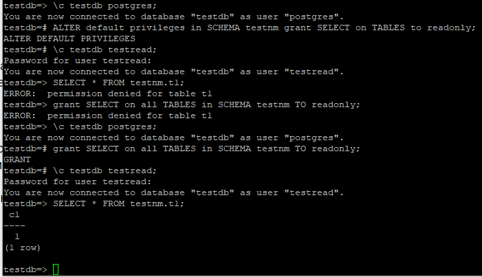  

теперь попробуйте выполнить команду create table t2(c1 integer); insert into t2 values (2);.
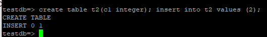  

а как так? нам же никто прав на создание таблиц и insert в них под ролью readonly?
есть идеи как убрать эти права? если нет - смотрите шпаргалку.
если вы справились сами то расскажите что сделали и почему, если смотрели шпаргалку - объясните что сделали и почему выполнив указанные в ней команды.
  смотрел в шпаргалку:
"
это все потому что search_path указывает в первую очередь на схему public. 
А схема public создается в каждой базе данных по умолчанию. 
И grant на все действия в этой схеме дается роли public. 
А роль public добавляется всем новым пользователям. 
Соответсвенно каждый пользователь может по умолчанию создавать объекты в схеме public любой базы данных, 
ес-но если у него есть право на подключение к этой базе данных. 
Чтобы раз и навсегда забыть про роль public - а в продакшн базе данных про нее лучше забыть - выполните следующие действия 
\c testdb postgres; 
REVOKE CREATE on SCHEMA public FROM public; 
REVOKE ALL on DATABASE testdb FROM public; 
\c testdb testread; 
"
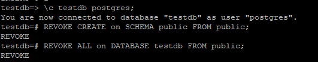  

теперь попробуйте выполнить команду create table t3(c1 integer); insert into t2 values (2);.
расскажите что получилось и почему.
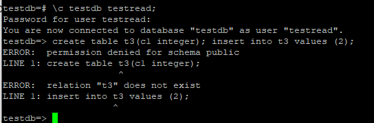

