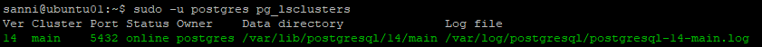
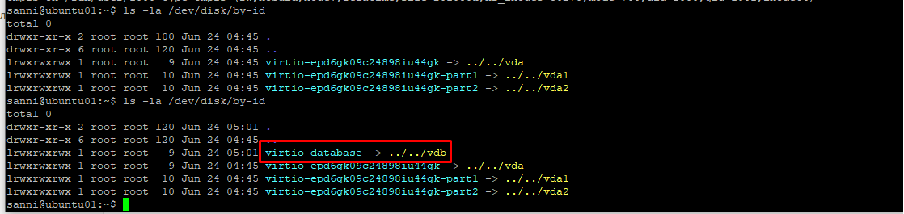
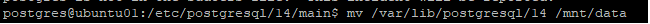
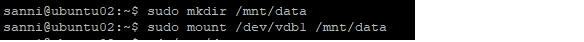

# Домашнее задание №4

*	**создайте новый кластер PostgresSQL 14**
*	**зайдите в созданный кластер под пользователем postgres**
*	**создайте новую базу данных testdb**
*	**зайдите в созданную базу данных под пользователем postgres**
*	**создайте новую схему testnm**
*	**создайте новую таблицу t1 с одной колонкой c1 типа integer**
*	**вставьте строку со значением c1=1**
*	**создайте новую роль readonly**
*	**дайте новой роли право на подключение к базе данных testdb**
*	**дайте новой роли право на использование схемы testnm**
*	**дайте новой роли право на select для всех таблиц схемы testnm**
*	**создайте пользователя testread с паролем test123**
*	**дайте роль readonly пользователю testread**
*	**зайдите под пользователем testread в базу данных testdb**
*	**сделайте select * from t1;**
*	**получилось? (могло если вы делали сами не по шпаргалке и не упустили один существенный момент про который позже)**
*	**напишите что именно произошло в тексте домашнего задания**
*	**у вас есть идеи почему? ведь права то дали?**
*	**посмотрите на список таблиц**
*	**подсказка в шпаргалке под пунктом 20**
*	**а почему так получилось с таблицей (если делали сами и без шпаргалки то может у вас все нормально)**
*	**вернитесь в базу данных testdb под пользователем postgres**
*	**удалите таблицу t1**
*	**создайте ее заново но уже с явным указанием имени схемы testnm**
*	**вставьте строку со значением c1=1**
*	**зайдите под пользователем testread в базу данных testdb**
*	**сделайте select * from testnm.t1;**
*	**получилось?**
*	**есть идеи почему? если нет - смотрите шпаргалку**
*	**как сделать так чтобы такое больше не повторялось? если нет идей - смотрите шпаргалку**
*	**сделайте select * from testnm.t1;**
*	**получилось?**
*	**есть идеи почему? если нет - смотрите шпаргалку**
*	**сделайте select * from testnm.t1;**
*	**получилось?**
*	**ура!**
*	**теперь попробуйте выполнить команду create table t2(c1 integer); insert into t2 values (2);**
*	**а как так? нам же никто прав на создание таблиц и insert в них под ролью readonly?**
*	**есть идеи как убрать эти права? если нет - смотрите шпаргалку**
*	**если вы справились сами то расскажите что сделали и почему, если смотрели шпаргалку - объясните что сделали и почему выполнив указанные в ней команды**
*	**теперь попробуйте выполнить команду create table t3(c1 integer); insert into t2 values (2);**
*	**расскажите что получилось и почему**

Созданы две виртуальные машины c Ubuntu 22.04 LTS на Яндекс Облаке (ubuntu01 и ubuntu02).

На них усановлены PostgreSQL 14 (преподаватель данного урока разрешил ставить версию PostgreSQL на наше усмотрение, на суть это не влияет) через sudo apt.
Проверьте что кластер запущен через sudo -u postgres pg_lsclusters

Зайдите из под пользователя postgres в psql и сделайте произвольную таблицу с произвольным содержимым.  
postgres=# create table test(c1 text);  
postgres=# insert into test values('1');  
\q  

Остановите postgres например через sudo -u postgres pg_ctlcluster 15 main stop.

Создайте новый диск к ВМ размером 10GB.

Для подключения диска я использовал инструкцию от яндекса: https://yandex.cloud/ru/docs/compute/operations/vm-control/vm-attach-disk?utm_referrer=https%3A%2F%2Fwww.google.com%2F  

Добавьте свеже-созданный диск к виртуальной машине - надо зайти в режим ее редактирования и дальше выбрать пункт attach existing disk.  

Данная комадна запускалась до и после присоединения нового диска. Появившийся диск выделен рамочкой.  

Так же посмотрел что выдаёт команда: sudo fdisk -l  

  
На основании этой информации сделал вывод, что наш новый диск определился в системе как /dev/vdb.  

Затем той же утилитой fdisk создал раздел, сделал его основным, указал ему номер 1.

Отформатировал раздел в файловую систему ext4.  

Создал каталог /mnt/data, сделал пользователя postgres его владельцем, смонтировал в него наш раздел. Узнал UUID раздела и прописал его в /etc/fstab.

Проверил состояние файловых систем.  

Перегрузил ВМ и снова проверил.  

Остановил postgres например через sudo -u postgres pg_ctlcluster 14 main stop.

Перенёс содержимое /var/lib/postgres/14 в /mnt/data - mv /var/lib/postgresql/14/mnt/data.  

Попытайтесь запустить кластер - sudo -u postgres pg_ctlcluster 14 main start.
  
Выдаёт ошибку, так как не может зачитать каталог с базами данных.

Задание: найти конфигурационный параметр в файлах раположенных в /etc/postgresql/14/main который надо поменять и поменяйте его.  
Нужно внести правку в файл /etc/postgresql/14/main/postgresql.conf:  

После этого кластер поднимется и видно что директория с данными теперь используется другая - /mnt/data/14/main:  

Можно зайти и проверить, что данные на месте:  

Далее отсоединил диск от первой ВМ и присоединил его ко второй. Проделал следующие манипуляции:  
  
  
  
  
  
  
  
  
  
  
  

Далее пропишем в etc/fstab UUID раздела, что бы после перезагрузки всё работало, перезагрузим ВМ и проверим:
  
  
  

