# Домашнее задание №5

* **Создать инстанс ВМ с 2 ядрами и 4 Гб ОЗУ и SSD 10GB**  
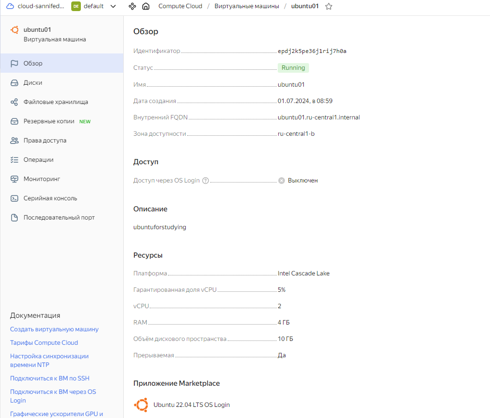  

* **Установить на него PostgreSQL 16 с дефолтными настройками**  
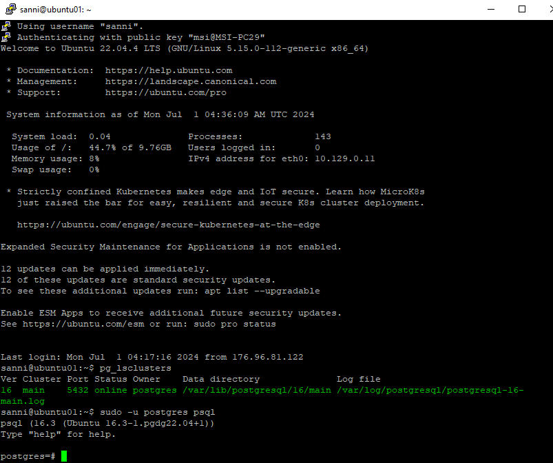  

* **Создать БД для тестов: выполнить pgbench -i postgres**  
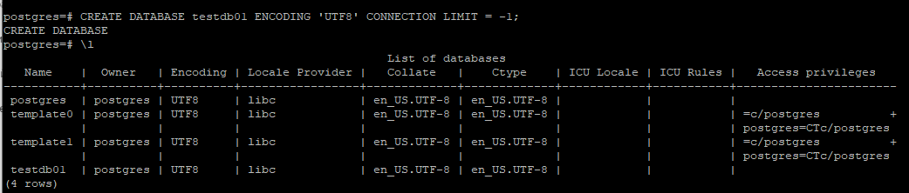  
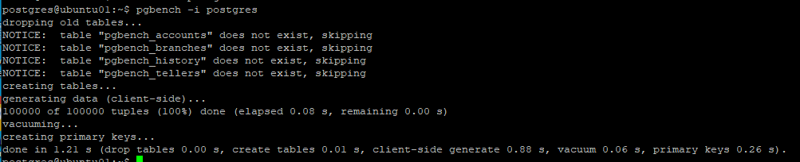  

* **Запустить pgbench -c8 -P 6 -T 60 -U postgres postgres**  
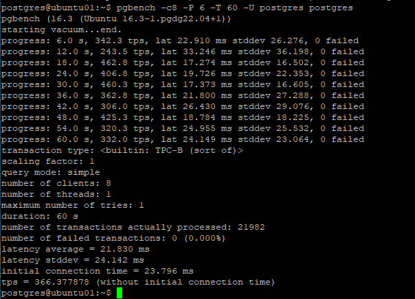  

* **Применить параметры настройки PostgreSQL из прикрепленного к материалам занятия файла**
_Внёс правки в конфигурационный файл /etc/postgresql/16/main/postgresql.conf  и перегрузил кластер_

* **Протестировать заново**  
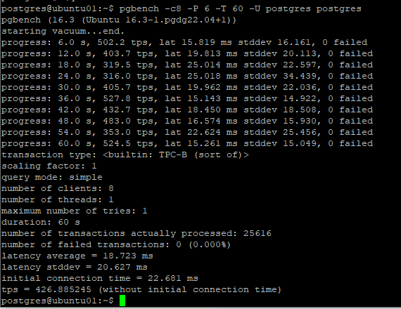  

* **Что изменилось и почему?**
_Время отклика (latency) уменьшилось (с 21.830 ms до 18.723 ms) и пропускная способность (tps - число транзакций в секунду) увеличилась (c 366.377878 до 426.885245). Почему именно на такие величины изменилось мне довольно трудно ответить. Есть понимание, что мы увеличили значения по-умолчанию и это неминуемо должно положительно сказаться на производительности. Буду рад вашим замечаниям по этому поводу и приму их к сведению._  

* **Создать таблицу с текстовым полем и заполнить случайными или сгенерированными данным в размере 1млн строк**
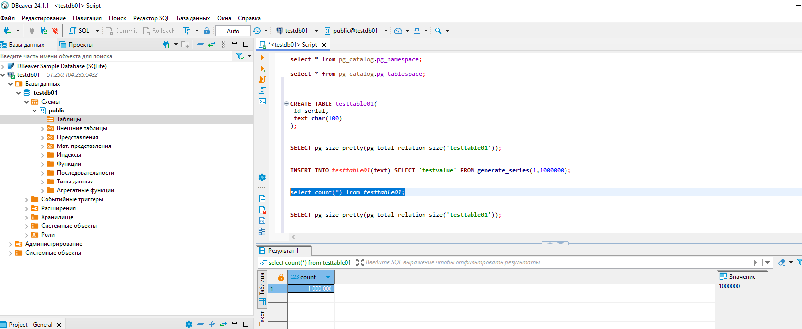  

* **Посмотреть размер файла с таблицей**  
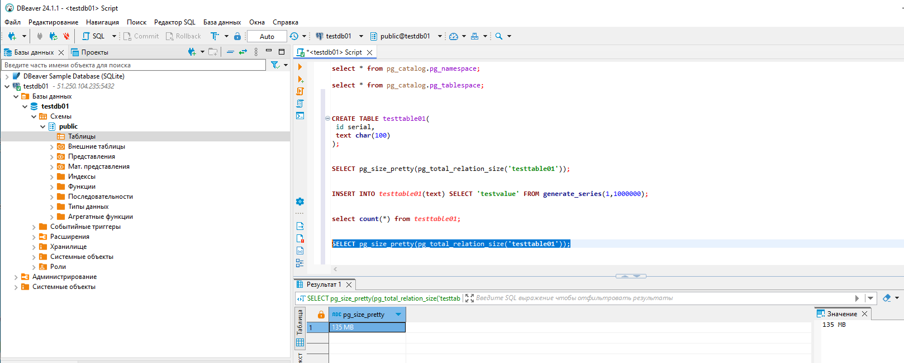  
  
* **5 раз обновить все строчки и добавить к каждой строчке любой символ**
* **Посмотреть количество мертвых строчек в таблице и когда последний раз приходил автовакуум**  
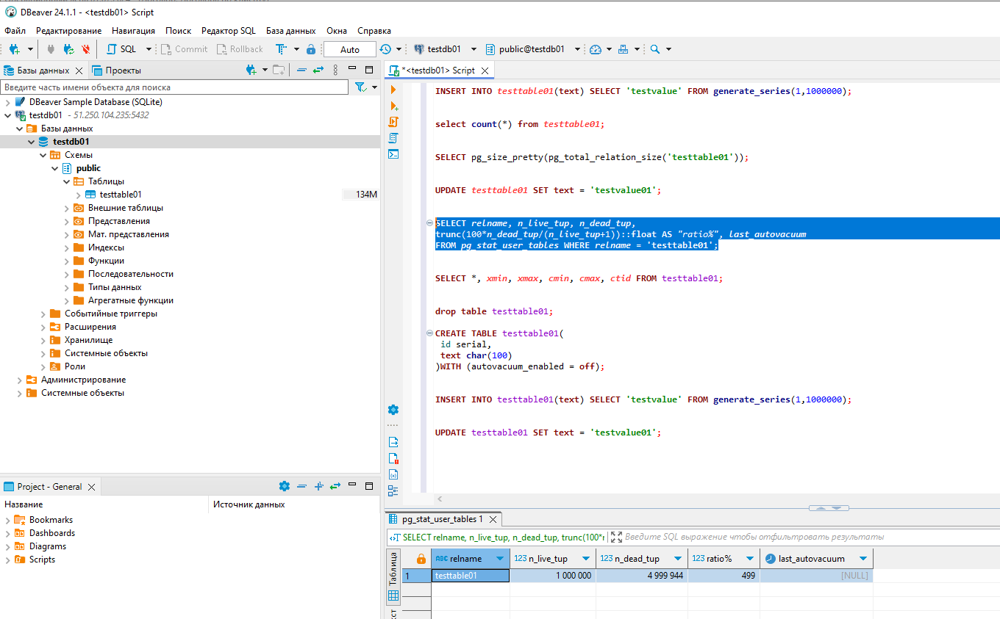

* **Подождать некоторое время, проверяя, пришел ли автовакуум**  
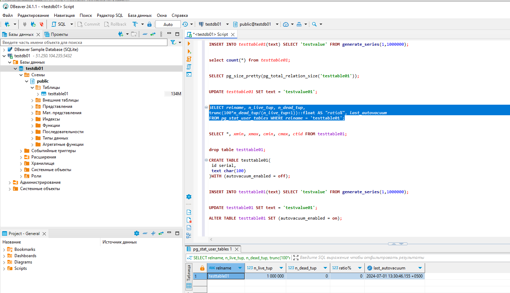

_Мои комменатрии: В процессе первых пяти апдейтов размер таблицы менялся так: + 1(269MB)+1(404MB)+1(539MB)+1(674MB)+1(808MB)
Итоговое число мёртвых строк: 4999944
Автовакуум прошёл, удалил мёртвые строки, размер остался как и был 808MB._  

* **5 раз обновить все строчки и добавить к каждой строчке любой символ**  
* **Посмотреть размер файла с таблицей**  
* **Отключить Автовакуум на конкретной таблице**  
_В процессе вторых пяти апдейтов размер таблицы не изменился: + 1(808MB)+1(808MB)+1(808MB)+1(808MB)+1(808MB)
Итоговое число мёртвых строк: 4999944
Автовакуум прошёл, удалил мёртвые строки, размер остался как и был 808MB_  

* **10 раз обновить все строчки и добавить к каждой строчке любой символ**  
* **Посмотреть размер файла с таблицей**  
* **Объясните полученный результат**

_В процессе последних десяти апдейтов размер таблицы менялся так: + 1(808MB)+1(808MB)+1(808MB)+1(808MB)+1(808MB)+1(943MB)+1(1078MB)+1(1212MB)+1(1347MB)+1(1482MB)
Итоговое число мёртвых строк: 9998216
Автовакум не пришёл, так как был отключен на таблице в прошлом шаге_  

* **Задание со '*':  
Написать анонимную процедуру, в которой в цикле 10 раз обновятся все строчки в искомой таблице.  
Не забыть вывести номер шага цикла.**
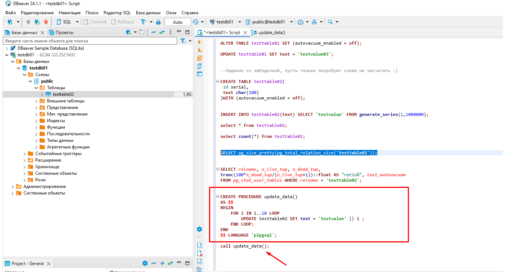

