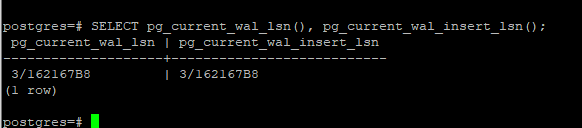
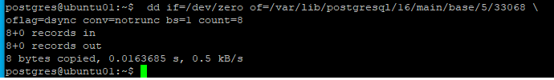

# Домашнее задание №6

* **Настройте выполнение контрольной точки раз в 30 секунд.**  
  

* **10 минут c помощью утилиты pgbench подавайте нагрузку.**  
_Перед запуском pgbench запомнил текущий LSN (так как нагрузки пока нет, то pg_current_wal_lsn = pg_current_wal_insert_lsn, можно брать любой из них).
Так же запомнил данные статистики (какое-то количество точек уже было сохранено, так как я проводил некоторые эксперименты с кластером до этого). Примем эти данные за точку отсчёта._  
  
  

_Запустил pgbench_  
  
  

* **Измерьте, какой объем журнальных файлов был сгенерирован за это время. Оцените, какой объем приходится в среднем на одну контрольную точку.**  
* **Проверьте данные статистики: все ли контрольные точки выполнялись точно по расписанию. Почему так произошло?**  
_После завершения работы pgbench снова смотрим текущий LSN (так как нагрузки снова нет, то pg_current_wal_lsn = pg_current_wal_insert_lsn)._  
  
_И снова снимаем данные статистики_  
  

_Вычисляем разницу между LSN, получаем 423045016 байт потребовалось системе что бы зафиксировать в журнале работу pgbench._  
_Сравнив данные статистики до и после можно сделать вывод, что было создано 20 контрольных точек по расписанию (checkpoints_timed (88 - 68 = 20)), а число точек по требованию (checkpoints_req не изменилось (2))._  
_Следовательно, на каждую контрольную точку приходится 423045016 / 20 = 21152250,8 байт._  
_На мой взгляд, количество созданных точек checkpoints_timed и не созданных checkpoints_req говорит о том, что всё прошло по плану (выбран приемлемый checkpoint_timeout ), каждые 30 секунд создавалась плановая контрольная точка и точек по требованию не было создано._  
_Буду рад вашим замечаниям по этому поводу (ссылкам на документацию), так как тема интересная. Необходимо понимать какие настройки журналирования лучше использовать в том или ином случае и на что при этом обращать внимание._  

* **Сравните tps в синхронном/асинхронном режиме утилитой pgbench. Объясните полученный результат.**  
_Запустил pgbench в синхронном режиме._  
  

_Переключился в асинхронный режим_
  

_Запустил pgbench в асинхронный режиме._  
  

_В результате видим, что в асинхронном режиме время отклика (latency (3.206 ms -> 0.540 ms)) существенно уменьшилось, а пропускная способность (tps) увеличилась (311.953344 -> 1851.252304)._  
_Плата за это - меньшая надежность. Цитата из книги (PostgreSQL изнутри):
"Асинхронная запись эффективнее синхронной — фиксация изменений не ждет физической записи на диск. Однако надежность уменьшается: в случае сбоя зафиксированные данные могут пропасть, если после
фиксации прошло менее 3 × wal_writer_delay единиц времени (что при настройке по умолчанию составляет 0,6 секунды)."_  

* **Создайте новый кластер с включенной контрольной суммой страниц. Создайте таблицу. Вставьте несколько значений. Выключите кластер. Измените пару байт в таблице. Включите кластер и сделайте выборку из таблицы. Что и почему произошло? как проигнорировать ошибку и продолжить работу?**  
_Создавать новый кластер я не стал. Поменял параметр в текущем кластере._  
  
  
  
_Запустил кластер, создал таблицу и три строки в ней._  
  
_Снова опустил кластер предварительно записав путь до таблицы в файловой системе_  
  
_Командой (взятой из той же книги, правда путь мне пришлось немного изменить) внёс изменения в файл._  
  
_Запустил кластер и пробовал зачитать строки из таблицы, получил ошибку, так как рассчитанная контрольная сумма не соответствует ожидаемой:_  
  
_Можно проигнорировать данную ошибку таким образом:_  

_Понято дело, что при игнорировании данной ошибки есть риск получить искажённую информацию_

