# Домашнее задание №7

* **Настройте сервер так, чтобы в журнал сообщений сбрасывалась информация о блокировках, удерживаемых более 200 миллисекунд. Воспроизведите ситуацию, при которой в журнале появятся такие сообщения.**  
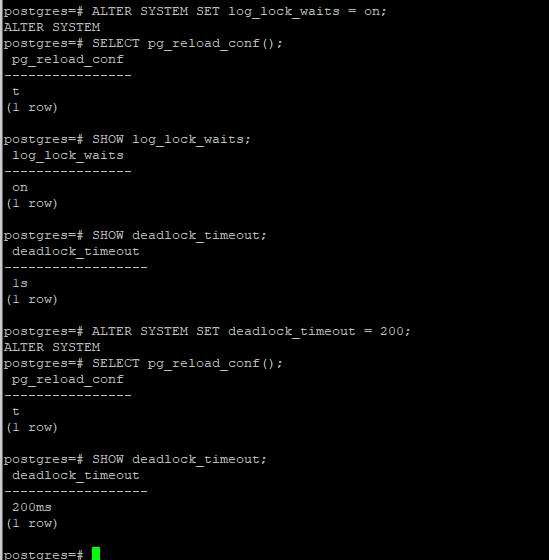  
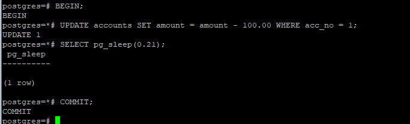  
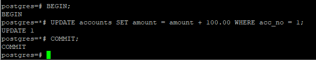  
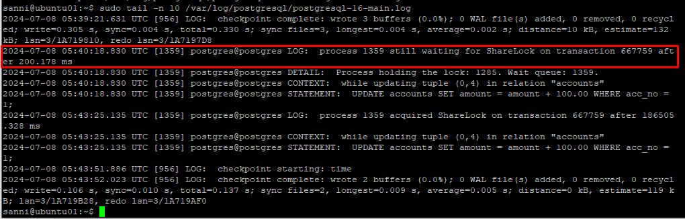  
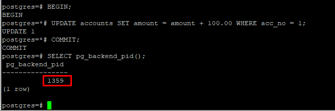  
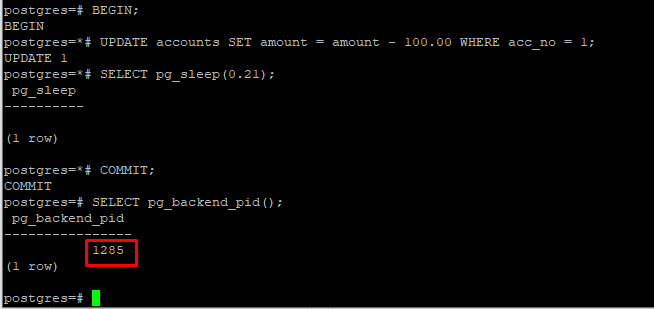  
_В принципе по скринам всё должно быть понятно. Делалось в двух сессиях. PID первой = 1285, PID второй 1359._  

* **Смоделируйте ситуацию обновления одной и той же строки тремя командами UPDATE в разных сеансах. Изучите возникшие блокировки в представлении pg_locks и убедитесь, что все они понятны. Пришлите список блокировок и объясните, что значит каждая.**  
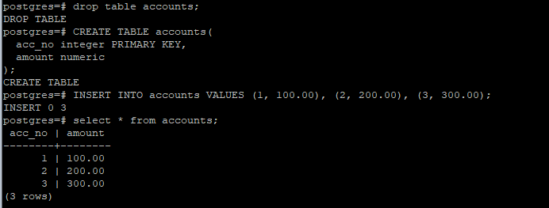  
_Удаление, создание и заполнение таблицы accounts_  
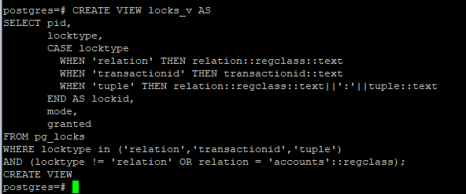  
_Построим представление над pg_locks. Оно содержит только то что нужно для нашего эксперимента._  

_Выдержка из книги (PostgreSQL 16 изнутри), только вчитываясь в эти строки я начал что-то понимать:_  
_Когда транзакция собирается изменить строку, она выполняет следующую последовательность действий:_  
_1) если поле xmax и информационные биты версии строки указывают на то, что строка заблокирована в несовместимом режиме, захватывает исключительную тяжелую блокировку изменяемой версии строки;  
2) при необходимости дожидается освобождения несовместимых блокировок, запрашивая блокировку номера транзакции xmax (или нескольких транзакций, если xmax — мультитранзакция);  
3) прописывает в версию строки свой номер (в поле xmax) и устанавливает необходимые информационные биты;  
4) освобождает блокировку версии строки, если она захватывалась в п. 1._  

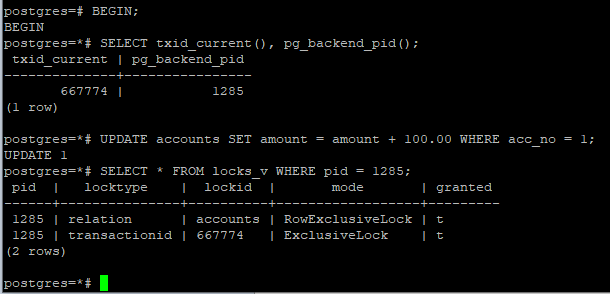  
_Транзакция успешно выполняет четыре шага последовательности и теперь удерживает блокировку таблицы._  

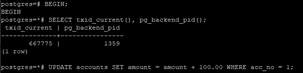  
_Начинаем вторую транзакцию и пытаемся обновить ту же строку._  

  
_Вторая транзакция дошла только до второго шага. Поэтому, помимо блокировки таблицы и собственного номера, она добавляет в pg_locks еще две
строки: захваченную на первом шаге блокировку типа tuple и запрошенную на втором шаге блокировку номера первой транзакции._  

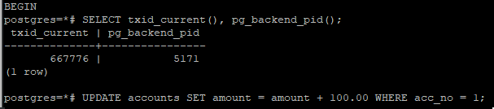  
_Запуск третьей транзакции._  

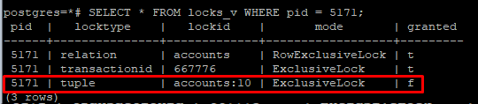  
_Третья транзакция дойдет только до первого шага. Она попытается захватить блокировку версии строки и остановится уже на этом._  
_К слову четвертая и последующие транзакции, желающие обновить ту же самую строку, ничем не будут отличаться от третьей — все они будут ожидать одну
и ту же блокировку версии строки._  

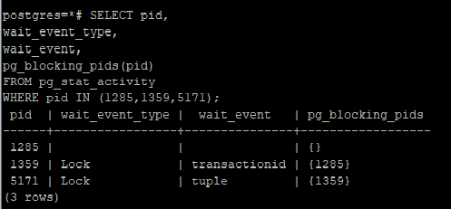  
_Получившуюся очередь можно увидеть таким способом._  

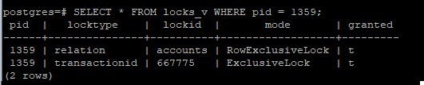  
_COMMITим первую транзакцию, вторая просыпается и успешно выполняет третий и четвертый шаги последовательности._  

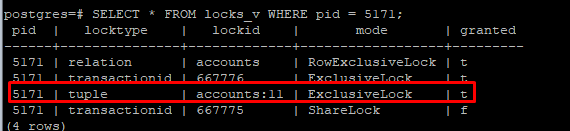  
_В моём эсперименте получаем такую картину. Третья транзакция осуществила захват блокировки версии строки_  
_При этом в книге, по инструкциям которой я следовал, автор пишет, что этого не должно было бы произойти:_  
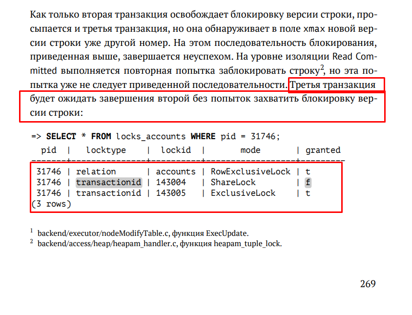  
_Почему произошло такое расхождение действительности с книгой я не понимаю, видимо я что-то сделал не так, ибо книга не может ошибаться :)_  

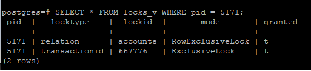  
_COMMITим вторую транзакцию. У третьей транзакции остаются только блокировки её номера и таблицы._  

_COMMIT третью транзакцию - блокировки исчезают._  

* **Воспроизведите взаимоблокировку трех транзакций. Можно ли разобраться в ситуации постфактум, изучая журнал сообщений?**  
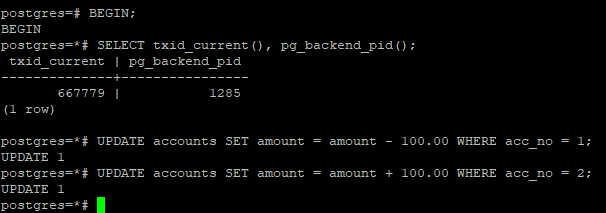  
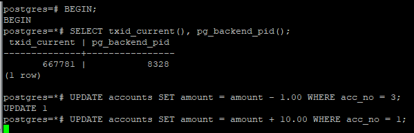  
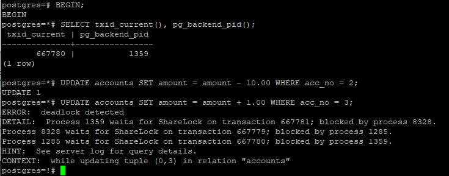  
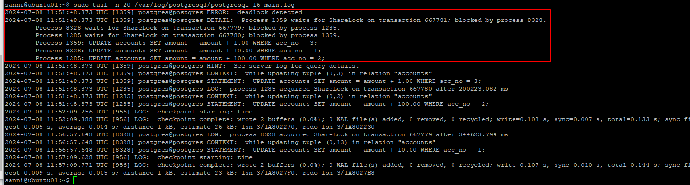
_Как и в первом задании, считаю что скринов достаточно, как ни странно в учебной литературе мне встретились только примеры взаимоблокировки двух транзакций, так что мне пришлось немного поэкспериментировать, что бы вызвать взаимоблокировку трёх транзакций._  

* **Могут ли две транзакции, выполняющие единственную команду UPDATE одной и той же таблицы (без where), заблокировать друг друга?**  
_В ходе эксперимента (основу которого я взял из книги) я установил что без where транзакции не должны заблокировать друг друга. Но я не исключаю, что я чего-то мог не учесть._  

_Описание эксперимента:_  

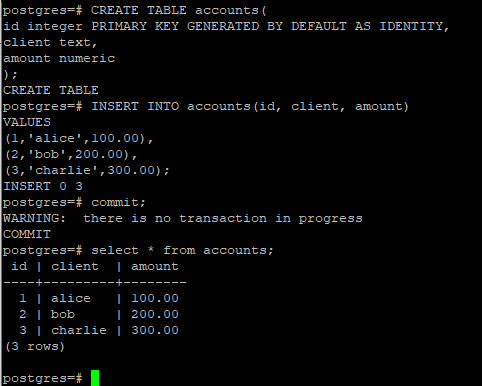  
_Создадим таблицу и заполним её данными._  

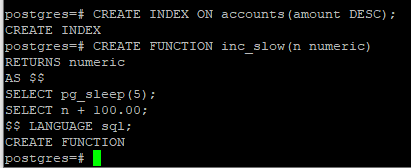  
_Для воспроизведения создадим индекс по столбцу amount, построенный по убыванию суммы_  
_Чтобы успеть увидеть происходящее, напишем замедляющую функцию_  

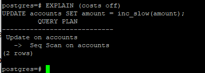  
_Первая команда UPDATE будет обновлять всю таблицу. План выполнения — последовательный просмотр всей таблицы_  

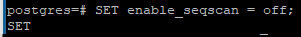  
_Во второй сессии запретим использование последовательного сканирования_  

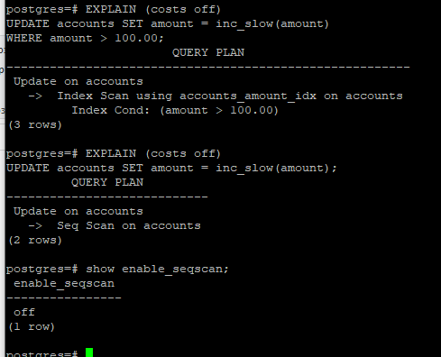  
_И проверим план запроса (если условие where есть)  
postgres=# EXPLAIN (costs off)  
UPDATE accounts SET amount = inc_slow(amount)  
WHERE amount > 100.00;  
                       QUERY PLAN  
    ---------------------------------------------  
 Update on accounts  
   ->  Index Scan using accounts_amount_idx on accounts  
         Index Cond: (amount > 100.00)_  
         
_Как видим, будет использоваться индекс и следовательно данный апдейт пойдёт по записям в обратном порядке (так как индекс был создан с параметром DESC, по убыванию)  
Однако если убрать из запроса условие, то видим следующий план запроса:_  

postgres=# EXPLAIN (costs off)  
UPDATE accounts SET amount = inc_slow(amount);  
         QUERY PLAN    
    ---------------------------------------------  
 Update on accounts  
   ->  Seq Scan on accounts  
_То есть в данном случае наш апдейт пойдёт точно так же как и в первой сессии и взаимоблокировки не будет._  

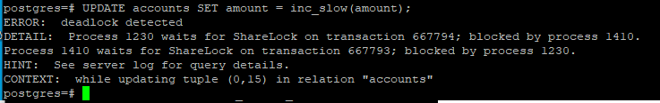  
_Скрин возникновения взаимоблокировки в первой сессии, если во второй запустить апдейт с условием (WHERE amount > 100.00;).  
Взаимоблокировка возникает из-за того что апдейту навстречу друг другу._  

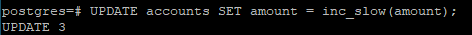  
_Если же запускать апдейт без условия то всё отрабатывает без взаимоблокировок в обейх сессия, так как апдейты идут "друг за другом", а не навстречу._  
