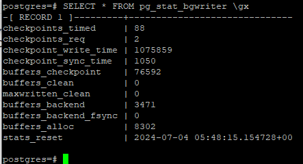
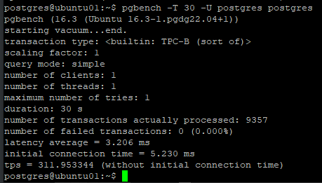
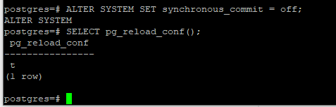
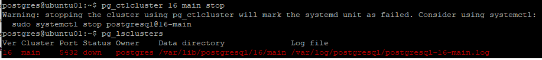
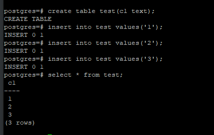
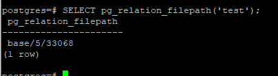

# Домашнее задание №7

* **Настройте сервер так, чтобы в журнал сообщений сбрасывалась информация о блокировках, удерживаемых более 200 миллисекунд. Воспроизведите ситуацию, при которой в журнале появятся такие сообщения.**  
  
  
  
  
  
  
_В принципе по скринам всё должно быть понятно. Делалось в двух сессиях. PID первой = 1285, PID второй 1359._  

* **Смоделируйте ситуацию обновления одной и той же строки тремя командами UPDATE в разных сеансах. Изучите возникшие блокировки в представлении pg_locks и убедитесь, что все они понятны. Пришлите список блокировок и объясните, что значит каждая.**  
  
_Удаление, создание и заполнение таблицы accounts_  
  
_Построим представление над pg_locks. Оно содержит только то что нужно для нашего эксперимента._  

_Выдержка из книги (PostgreSQL 16 изнутри), только вчитываясь в эти строки я начал что-то понимать:_  
_Когда транзакция собирается изменить строку, она выполняет следующую последовательность действий:_  
_1) если поле xmax и информационные биты версии строки указывают на то, что строка заблокирована в несовместимом режиме, захватывает исключительную тяжелую блокировку изменяемой версии строки;  
2) при необходимости дожидается освобождения несовместимых блокировок, запрашивая блокировку номера транзакции xmax (или нескольких транзакций, если xmax — мультитранзакция);  
3) прописывает в версию строки свой номер (в поле xmax) и устанавливает необходимые информационные биты;  
4) освобождает блокировку версии строки, если она захватывалась в п. 1._  

  
_Транзакция успешно выполняет четыре шага последовательности и теперь удерживает блокировку таблицы._  

  
_Начинаем вторую транзакцию и пытаемся обновить ту же строку._  

  
_Вторая транзакция дошла только до второго шага. Поэтому, помимо блокировки таблицы и собственного номера, она добавляет в pg_locks еще две
строки: захваченную на первом шаге блокировку типа tuple и запрошенную на втором шаге блокировку номера первой транзакции._  

  
_Запуск третьей транзакции._  

  
_Третья транзакция дойдет только до первого шага. Она попытается захватить блокировку версии строки и остановится уже на этом._  
_К слову четвертая и последующие транзакции, желающие обновить ту же самую строку, ничем не будут отличаться от третьей — все они будут ожидать одну
и ту же блокировку версии строки._  

  
_Получившуюся очередь можно увидеть таким способом._  

  
_COMMITим первую транзакцию, вторая просыпается и успешно выполняет третий и четвертый шаги последовательности._  

  
_В моём эсперименте получаем такую картину. Третья транзакция осуществила захват блокировки версии строки_  
_При этом в книге, по инструкциям которой я следовал, автор пишет, что этого не должно было бы произойти:_  
  

  
  

* **Измерьте, какой объем журнальных файлов был сгенерирован за это время. Оцените, какой объем приходится в среднем на одну контрольную точку.**  
* **Проверьте данные статистики: все ли контрольные точки выполнялись точно по расписанию. Почему так произошло?**  
_После завершения работы pgbench снова смотрим текущий LSN (так как нагрузки снова нет, то pg_current_wal_lsn = pg_current_wal_insert_lsn)._  
  
_И снова снимаем данные статистики._  
  

_Вычисляем разницу между LSN, получаем 423045016 байт потребовалось системе что бы зафиксировать в журнале работу pgbench._  
  
_Сравнив данные статистики до и после можно сделать вывод, что было создано 20 контрольных точек по расписанию (checkpoints_timed (88 - 68 = 20)), а число точек по требованию (checkpoints_req не изменилось (2))._  
_Следовательно, на каждую контрольную точку приходится 423045016 / 20 = 21152250,8 байт._  
_На мой взгляд, количество созданных точек checkpoints_timed и не созданных checkpoints_req говорит о том, что всё прошло по плану (выбран приемлемый checkpoint_timeout ), каждые 30 секунд создавалась плановая контрольная точка и точек по требованию не было создано._  
_Буду рад вашим замечаниям по этому поводу (ссылкам на документацию), так как тема интересная. Необходимо понимать какие настройки журналирования лучше использовать в том или ином случае и на что при этом обращать внимание._  

* **Сравните tps в синхронном/асинхронном режиме утилитой pgbench. Объясните полученный результат.**  
_Запустил pgbench в синхронном режиме._  
  

_Переключился в асинхронный режим._  
  

_Запустил pgbench в асинхронный режиме._  
  

_В результате видим, что в асинхронном режиме время отклика (latency (3.206 ms -> 0.540 ms)) существенно уменьшилось, а пропускная способность (tps) увеличилась (311.953344 -> 1851.252304)._  
_Плата за это - меньшая надежность. Цитата из книги (PostgreSQL изнутри):
"Асинхронная запись эффективнее синхронной — фиксация изменений не ждет физической записи на диск. Однако надежность уменьшается: в случае сбоя зафиксированные данные могут пропасть, если после
фиксации прошло менее 3 × wal_writer_delay единиц времени (что при настройке по умолчанию составляет 0,6 секунды)."_  

* **Создайте новый кластер с включенной контрольной суммой страниц. Создайте таблицу. Вставьте несколько значений. Выключите кластер. Измените пару байт в таблице. Включите кластер и сделайте выборку из таблицы. Что и почему произошло? как проигнорировать ошибку и продолжить работу?**  
_Создавать новый кластер я не стал. Поменял параметр в текущем кластере._  
  
  
  
_Запустил кластер, создал таблицу и три строки в ней._  
  
_Снова опустил кластер предварительно записав путь до таблицы в файловой системе._  
  
_Командой (взятой из той же книги, правда путь мне пришлось немного изменить) внёс изменения в файл._  
  
_Запустил кластер и пробовал зачитать строки из таблицы, получил ошибку, так как рассчитанная контрольная сумма не соответствует ожидаемой:_  
  
_Можно проигнорировать данную ошибку таким образом:_  
  
_Понято дело, что при игнорировании данной ошибки есть риск получить искажённую информацию._

