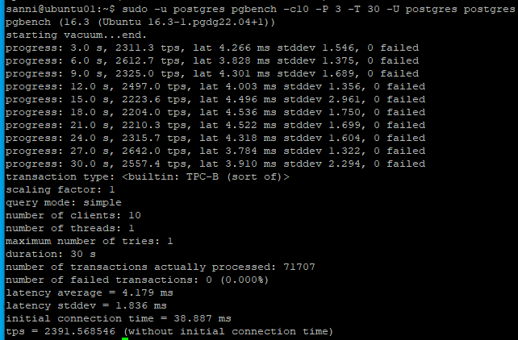

# Домашнее задание №8

* **Развернуть виртуальную машину любым удобным способом.**  
  
_Создана ВМ с самыми минимальными ресурсами, что бы минимизировать затраты на её содержание. Посмотрим, что можно выжать из неё в плане производительности PostgreSQL._  
_Сразу хочу сказать, что данная домашняя работа заняла у меня больше времени (в сравнении с предыдущими), так как в предыдущих работах был достаточно чёткий план действий, в этой же работе, я почувствовал, что действую 
 по большей части интуитивно (когда крутил все эти параметры настройки). Возможно дело в том, что я скорее отношу себя к разработчикам, нежели чем к администраторам, хотя по работе заниматься приходится и тем и другим. 
 Результат, конечно есть, но осталось чувство незавершённости и понимание того, что тюнинговать PostgreSQL можно практически бесконечно._  

* **Поставить на неё PostgreSQL 15 любым способом.**  
_На ВМ установлен PostgreSQL 16_  

* **настроить кластер PostgreSQL 15 на максимальную производительность не обращая внимание на возможные проблемы с надежностью в случае аварийной перезагрузки виртуальной машины.**  
  
  
_Создал свой конфигурационный файл custom.conf._  
_Прописал в нём параметры близкие, как мне думалось на тот момент, к масимально возможным (часть оставил на рекомендуемом уровне, поэкперименитовароть с ними решил на следующем шаге)._  

* **Нагрузить кластер через утилиту через утилиту pgbench (https://postgrespro.ru/docs/postgrespro/14/pgbench)**
* **написать какого значения tps удалось достичь, показать какие параметры в какие значения устанавливали и почему**  
  
_С такими параметрами имеем 216 tps._  
_Так, подумал я, а давайте-ка теперь последовательно менять каждый из параметров и замерять tps, интересно ведь. Таким образом, для каждого параметра я проводил замер tps при минимальном, среднем и максимальном его значении. И составлял у себя в блокнотике статистику. Делалось по три замера (на некоторых параметрах было и больше трёх), так как tps при каждом новом запуске теста мог колебаться и находилось среднее арифметическое згачение tps._  
  
_Часть моих записей, мало информативно, но смысл понятен._  
_Находя лучшее по производительности значение, заносил его в файл конфигурации. И шёл дальше._  
_В итоге у меня получился такой файл:_  
  
_При такой конфигурации тест выдавал максимально около 457 tps (min_wal_size я решил не выкручивать и оставил минимальным)._  
_Итого, tps удалось повысить 457/216 = 2,16 раза._  
_Немного посаморефлексировав и захотев цифр побольше, включил асинхронный режим и получил значение tps 2391. Это дало прирост в 2391/457 = 5,23 раза._  
  
  

_Включил синхронный режим обратно и перешёл к заданию со звёздочкой (действовал по инструкции преподавателя):_  
  
  
  
  
  
  
_Данный шаг мне удалось выполнить только такой командой: sysbench --db-driver=pgsql --table-size=100000 --tables=24 --threads=1 --pgsql-host=localhost --pgsql-port=5432 --pgsql-user=postgres --pgsql-password=123 --pgsql-db=sbtest /usr/share/sysbench/oltp_read_write.lua prepare и под пользователем postgres, с доступом пользователя я потом разобрался, а команду в инструкции видимо нужно актуализировать._  
  
  
_На данном шаге так же команда из инструкции не срабатывала, я запустил так:  
sysbench \  
--db-driver=pgsql \  
--report-interval=2 \  
--table-size=100000 \  
--tables=24 \  
--threads=64 \  
--time=60 \  
--pgsql-host=localhost \  
--pgsql-port=5432 \  
--pgsql-user=postgres \  
--pgsql-password=123 \  
--pgsql-db=sbtest \  
/usr/share/sysbench/oltp_read_write.lua \  
run_  
_В итоге тест подвис в процессе выполнения._  
_Пришлось уменьшить параметры в конфиге до более разумных, получилось так:_  
  
  
  
_После этого тест отработал и выдал 199.7 tps._

  
_Под пользователем sbtest тест не запускался так как у него не было прав на создание объектов в базе данных sbtest, хотя я строго придерживался инструкции. Сделал его владельцем базы и попробовал создать в ней таблицу, заработало._  

